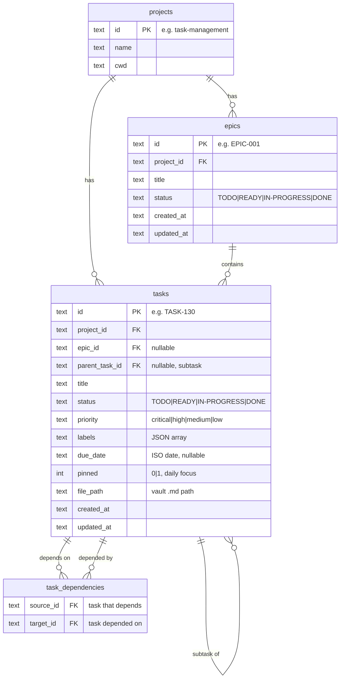
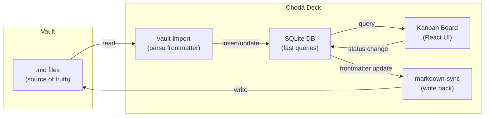
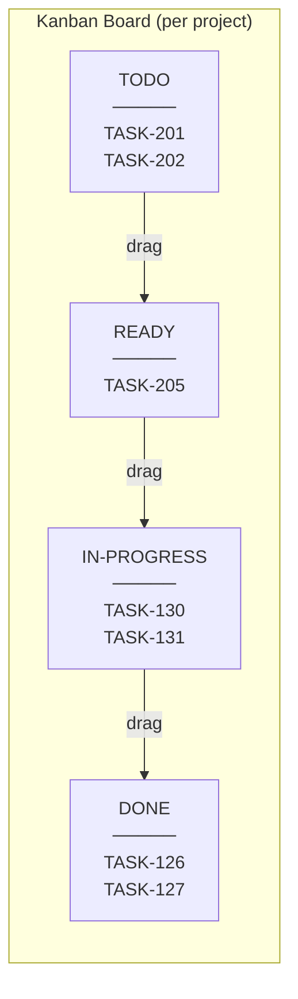
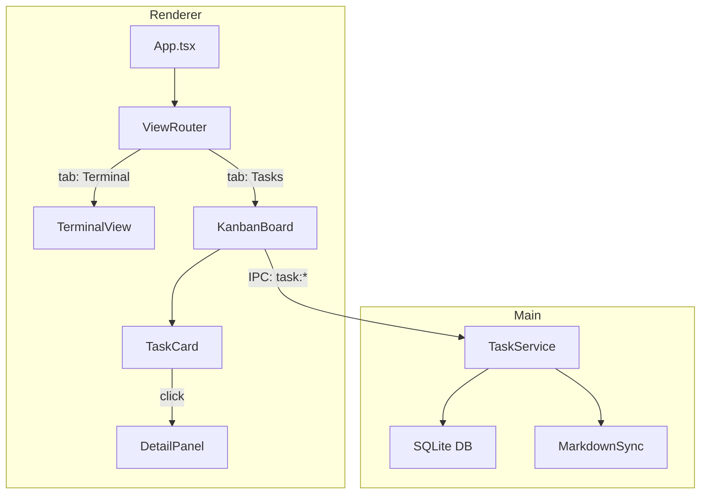

# ADR-004: SQLite embedded for task management data layer

## Context

Phase 1 cần data store cho Kanban board, epic/subtask hierarchy, task CRUD. Options: Neo4j (đã có), SQLite embedded, pure markdown.

Chọn **SQLite embedded** vì:
- Fast queries cho board rendering (no network round-trip)
- Offline-capable, zero external dependency
- Neo4j có thể remove trong tương lai — task data không nên phụ thuộc vào nó
- Markdown files vẫn là source of truth cho content, SQLite là derived index

## Schema

### ER Diagram



### Data Flow



### Kanban Board Layout



### Component Architecture



## Decision

### Statuses — hardcoded 4 columns

| Status | Kanban Column | Meaning |
|---|---|---|
| `TODO` | 1st | Backlog, not started |
| `READY` | 2nd | Ready to pick up |
| `IN-PROGRESS` | 3rd | Actively working |
| `DONE` | 4th | Completed |

No custom workflow in V1. Fixed 4 columns, any task can move to any status (no transition rules).

### IDs — vault IDs

Task IDs use existing vault convention: `TASK-130`, `EPIC-001`, etc. Not auto-increment integers. This keeps SQLite ↔ vault file mapping simple.

### Dependencies — SQLite table

`task_dependencies` table instead of Neo4j graph. Self-contained — no external DB dependency for core task management features. Neo4j remains optional for cross-project context queries.

### Indexes

```sql
CREATE INDEX idx_tasks_project ON tasks(project_id);
CREATE INDEX idx_tasks_status ON tasks(project_id, status);
CREATE INDEX idx_tasks_epic ON tasks(epic_id);
CREATE INDEX idx_tasks_parent ON tasks(parent_task_id);
```

## Consequences

- `better-sqlite3` package — synchronous, fast, no async overhead
- SQLite file at `{app-data}/choda-deck.db` (packaged) or `choda-deck.db` (dev)
- Import existing vault tasks on first run or on-demand
- Board changes write to SQLite immediately, markdown sync is async (debounced)
- Neo4j can be removed later without affecting task management
- No custom workflow — if needed later, add `workflows` + `statuses` tables

## Related

- [[TASK-301_sqlite-data-layer]]
- [[TASK-303_kanban-board]]
- [[TASK-308_markdown-sync]]
- [[phase-1-task-management]]
