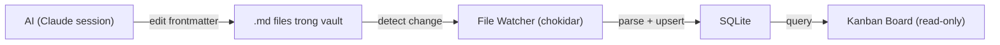
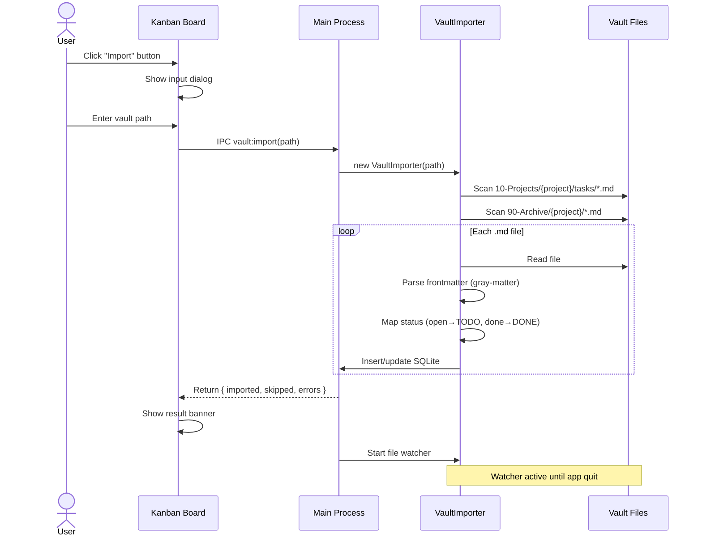

# ADR-005: Vault import + file sync — one-way, manual trigger

## Context

Board cần data từ vault .md files. Hai câu hỏi chính: (1) khi nào import, (2) sync hướng nào.

## Decision

### Board là read-only viewer



- **AI edit files** → file watcher detect → update SQLite → board refresh
- **Board không edit gì** — no drag-drop, no create, no delete
- User dùng AI trong terminal để thay đổi task status, title, priority

### Manual import trigger



- **Không auto-import on boot** — user quyết định khi nào import, từ path nào
- Sau import, file watcher bật real-time cho vault path đó
- Nút Refresh (↻) trên board để manual reload từ SQLite

### Status mapping

```
Vault frontmatter    →    Board status
─────────────────         ────────────
open                 →    TODO
todo                 →    TODO
ready                →    READY
in-progress          →    IN-PROGRESS
in progress          →    IN-PROGRESS
doing                →    IN-PROGRESS
done                 →    DONE
closed               →    DONE
(unknown/missing)    →    TODO
```

Mapping hardcoded trong `vault-importer.ts`. API hỗ trợ custom map nhưng UI chưa expose.

### What gets imported

```
Từ mỗi .md file, parse frontmatter:
├── id        → từ filename (TASK-130_xxx.md → TASK-130)
├── title     → frontmatter.title hoặc id
├── status    → map theo bảng trên
├── priority  → critical/high/medium/low (giữ nguyên)
├── labels    → frontmatter.labels (nếu có)
├── depends-on → tạo task_dependencies records
└── file_path → đường dẫn tuyệt đối tới .md file
```

### What does NOT get imported

- Epic/subtask relationships (chưa parse từ frontmatter)
- File content (body) — chỉ frontmatter
- Features, Decisions — chỉ tasks (TASK-xxx, BUG-xxx)

## Files involved

| File | Role |
|---|---|
| `src/tasks/vault-importer.ts` | Parse .md → SQLite, file watcher |
| `src/main/index.ts` | IPC `vault:import`, `vault:stop-watch` |
| `src/renderer/src/KanbanBoard.tsx` | Import button + dialog + result banner |
| `src/preload/index.ts` | `window.api.task.import()` |

## Trade-offs

- **Manual trigger** — user có thể quên import, nhưng tránh surprise data changes on boot
- **One-way only** — board không write back. Nếu user muốn change status, phải dùng AI edit file
- **Status mapping hardcoded** — custom mapping API có nhưng UI chưa expose. V2 nếu cần
- **No epic import** — vault files có `feature:` field nhưng chưa map sang epics

## Future

- UI cho status mapping config
- Auto-import option (toggle trong settings)
- Import epics từ vault feature files
- Import subtask relationships từ `parent-task` frontmatter field
- Conflict dialog khi file change + SQLite change cùng lúc

## Related

- [[TASK-308_markdown-sync]]
- [[ADR-004-sqlite-task-management]]
- [[TASK-303_kanban-board]]
