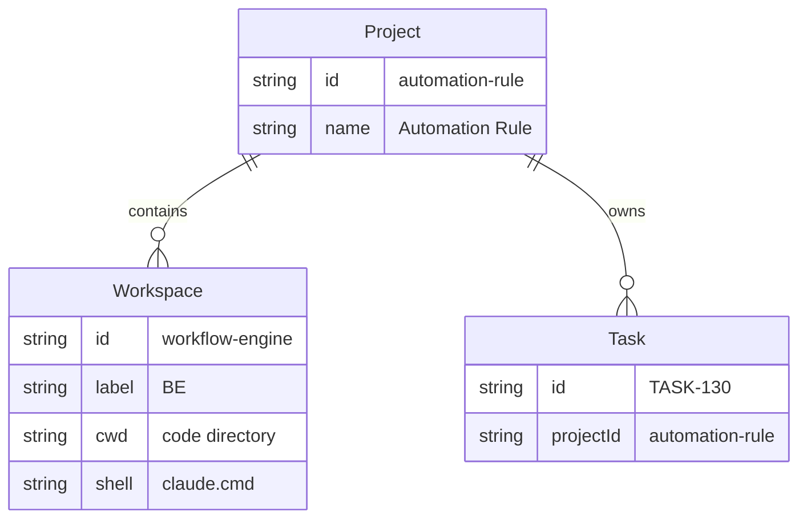
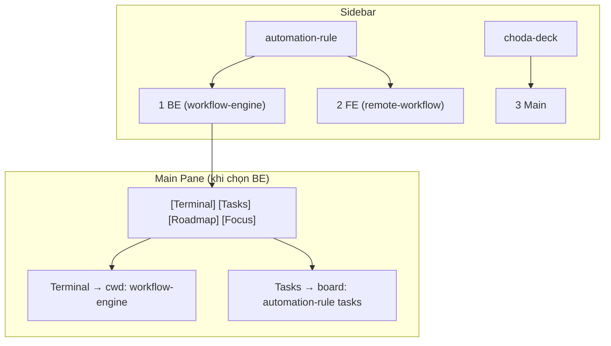
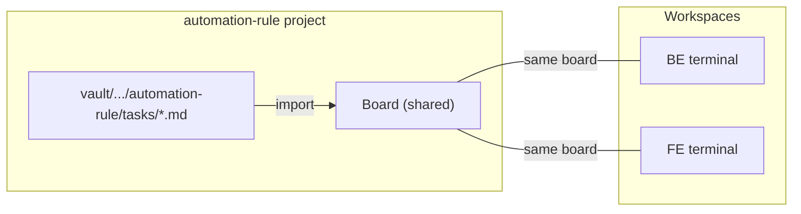

# ADR-006: Project vs Workspace — tách task ownership khỏi codebase

## Context

Hiện tại `projects.json` flat — mỗi entry = 1 terminal session + 1 task board. Nhưng thực tế:

- `automation-rule` là 1 project có tasks trong vault
- `workflow-engine` (BE) và `remote-workflow` (FE) là 2 codebases thuộc project đó
- Tasks sống ở `automation-rule`, code sống ở `workflow-engine` / `remote-workflow`

Flat structure không thể hiện được relationship này.

## Decision

Tách 2 concepts:



### Config schema (`projects.json`)

```json
{
  "contentRoot": "C:\\Users\\hngo1_mantu\\vault",
  "projects": [
    {
      "id": "automation-rule",
      "name": "Automation Rule",
      "workspaces": [
        { "id": "workflow-engine", "label": "BE", "cwd": "C:\\dev\\test\\workflow-engine" },
        { "id": "remote-workflow", "label": "FE", "cwd": "C:\\dev\\test\\remote-workflow" }
      ]
    },
    {
      "id": "choda-deck",
      "name": "Choda Deck",
      "workspaces": [
        { "id": "choda-deck", "label": "Main", "cwd": "C:\\dev\\choda-deck" }
      ]
    }
  ]
}
```

### Content path derivation

All content paths derived from `contentRoot + projectId`:
- Tasks: `{contentRoot}/10-Projects/{projectId}/tasks/`
- Phases: `{contentRoot}/10-Projects/{projectId}/phases/`
- Docs: `{contentRoot}/10-Projects/{projectId}/docs/`
- Archive: `{contentRoot}/90-Archive/{projectId}/`

No per-project `taskPath` — PARA folder structure is convention, not config.

### Sidebar layout



### Key rule: Tasks belong to Project, Terminal belongs to Workspace

| Concept | Tasks tab shows | Terminal opens at |
|---|---|---|
| Click "BE" under automation-rule | automation-rule tasks | `C:\dev\test\workflow-engine` |
| Click "FE" under automation-rule | automation-rule tasks (same!) | `C:\dev\test\remote-workflow` |
| Click "Main" under choda-deck | choda-deck tasks | `C:\dev\choda-deck` |

Multiple workspaces share the same task board — vì tasks thuộc project, không thuộc workspace.

### Import flow



Import dùng `contentRoot + projectId`, không phải `cwd` của workspace.

## Impact on existing code

| Component | Change |
|---|---|
| `projects.json` | New schema: project → workspaces[] |
| `src/main/index.ts` | Load new schema, map workspace → project for task queries |
| `Sidebar.tsx` | Tree view: project headers → workspace items |
| `KanbanBoard.tsx` | Query by `projectId` (từ workspace's parent project) |
| `TerminalView.tsx` | Spawn pty at workspace `cwd` (no change in logic) |
| `vault-importer.ts` | Import from `contentRoot + projectId`, not workspace `cwd` |
| `ViewRouter.tsx` | Pass both `project` and `workspace` to views |

## Trade-offs

- **More complex config** — nhưng phản ánh đúng reality
- **Shared board** — 2 workspaces cùng project nhìn cùng board. Nếu sau cần per-workspace filter → add filter, không redesign
- **Breaking change** — `projects.json` schema thay đổi, cần migrate existing config

## Alternatives considered

| Option | Rejected because |
|---|---|
| Flat with naming convention (`automation-rule/workflow-engine`) | Không link được tasks → workspace |
| Tags/groups | Không thể hiện ownership (tasks thuộc group nào?) |
| Separate task-projects.json + workspace.json | Over-engineering cho 1 file config |

## Related

- [[ADR-002-multi-project-sidebar]]
- [[ADR-004-sqlite-task-management]]
- [[ADR-005-vault-import-sync]]
