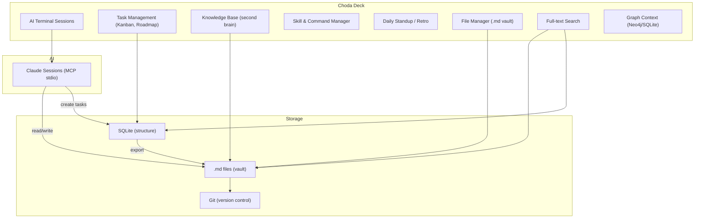
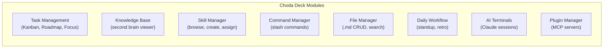
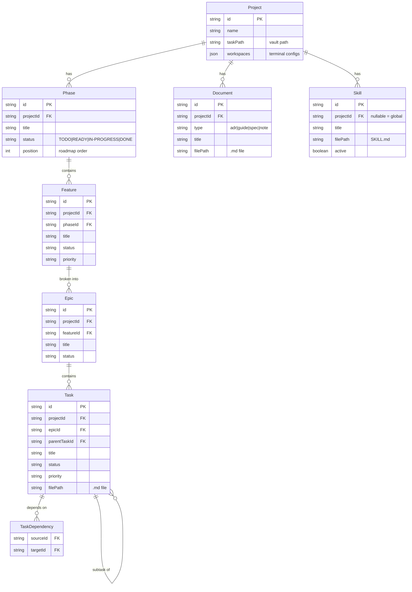
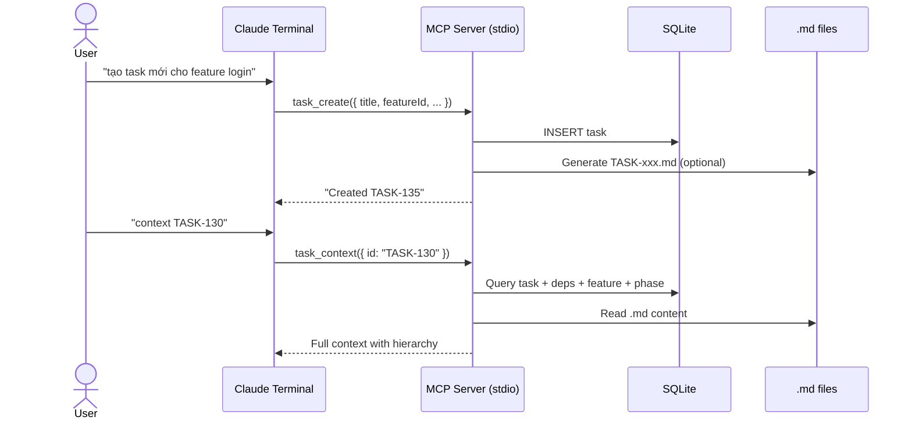
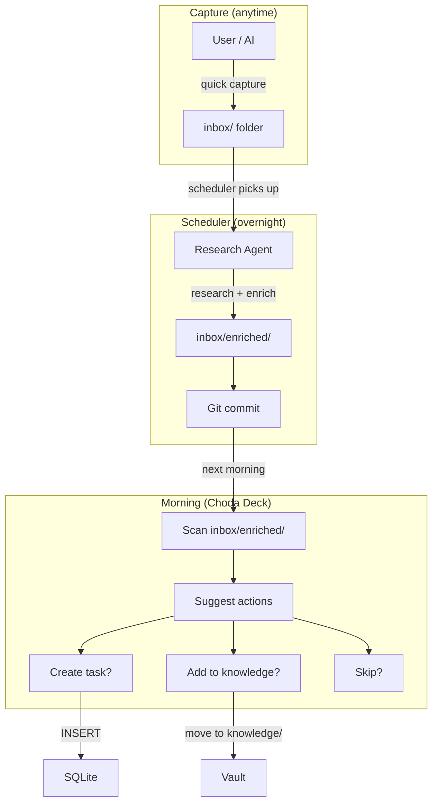
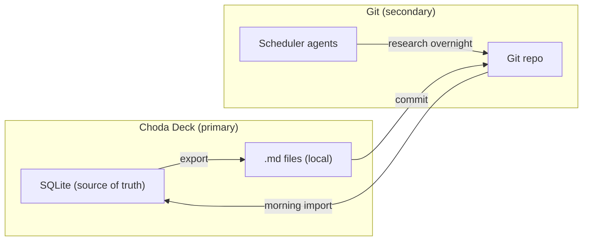

# ADR-007: Choda Deck — comprehensive AI workspace replacing Obsidian

## Context

Hiện tại workflow dùng Obsidian + Choda Deck + Claude Desktop. Nhưng thực tế:
- 100% content viết bởi AI, không viết tay
- Obsidian chỉ là file viewer + search — core value = manage `.md` files
- Claude Desktop đang bị thay thế bởi Choda Deck terminal sessions
- Obsidian plugins (dataview, templater) không dùng — AI thay thế hết

Obsidian core chỉ làm 4 việc: file explorer, markdown render, search, wikilink resolution. Choda Deck có thể làm cả 4 + nhiều hơn.

## Decision

**Choda Deck = comprehensive AI workspace** — thay thế hoàn toàn Obsidian.

### Vision

### What replaces what

| Obsidian feature | Choda Deck replacement |
|---|---|
| File explorer | Built-in file browser for vault |
| Markdown renderer | Markdown viewer (detail panel, doc viewer) |
| Search | Full-text search across vault + SQLite |
| Wikilinks `[[note]]` | Wikilink resolution + graph relationships |
| Daily notes | Daily standup / Focus view |
| Graph view | Graph CLI + built-in graph viewer |
| Plugins (dataview, kanban) | Native: Kanban board, Roadmap, Focus |
| Templates | AI generates via MCP tools |
| Obsidian MCP | Not needed — AI runs inside Choda Deck |

### Core modules

### Data architecture

### Source of truth

| Data | Source of truth | Reason |
|---|---|---|
| Task structure (status, priority, relationships) | **SQLite** | Fast queries, structured |
| Content (descriptions, specs, ADRs) | **.md files** | Git-friendly, AI read/write |
| Relationships (task→feature→phase) | **SQLite** | Queryable hierarchy |
| Knowledge articles | **.md files** | Second brain, wikilinks |
| Skills | **.md files** (SKILL.md) | Claude reads directly |
| Roadmap | **SQLite** | Phase ordering, progress |

**Rule:** Structure in SQLite, content in `.md` files. Wikilinks in `.md` resolve via file system.

### AI interaction (MCP stdio)

### Wikilinks

`.md` files vẫn dùng `[[wikilink]]` syntax. Choda Deck resolve:
1. Scan vault cho matching filename
2. Render as clickable link trong viewer
3. Graph relationships từ SQLite bổ sung (stronger than text wikilinks)

### Inbox + Scheduler flow

**Flow:**
1. User captures thought anytime → `inbox/` folder (quick .md file)
2. Scheduler agents run overnight → research, enrich, commit to git
3. Morning: Choda Deck scans `inbox/enriched/`
4. Suggests: tạo task? thêm vào knowledge base? skip?
5. User confirms → Choda Deck executes (INSERT SQLite / move file)

Inbox lives **outside** project folders — it's a cross-project capture point.

### Git role

Git is NOT required for Choda Deck to function. Git serves:
- **Backup** — version history for .md files
- **Scheduler** — background agents commit research results
- **Collaboration** — share vault via git (future)

Choda Deck works fully offline with just SQLite + local .md files.

## Implementation phases

### Phase A — SQLite hierarchy (next)

- Add Phase + Feature tables to SQLite
- Import existing vault phases/features
- Roadmap view reads from SQLite phases
- Task → Epic → Feature → Phase hierarchy

### Phase B — File manager + markdown viewer

- Built-in file browser for vault
- Markdown renderer (view .md files in app)
- Wikilink resolution (click `[[link]]` → navigate)
- Full-text search

### Phase C — Knowledge base + skills + inbox

- Browse knowledge articles (30-Knowledge/)
- Skill catalog viewer + creator
- Command manager
- Daily standup / retro views
- Inbox processing: scan enriched, suggest actions

### Phase D — Standalone workspace

- All Obsidian workflows covered
- Scheduler integration (scan git for overnight results)
- Choda Deck is standalone comprehensive workspace
- Obsidian optional — user can still use if they want

## Risks

| Risk | Mitigation |
|---|---|
| Scope creep — building IDE | Focus: AI workflow + task mgmt, not general editor |
| SQLite corruption | .md files as backup, git versioning |
| Losing mobile access | .md files in git, viewable anywhere |
| Markdown rendering quality | Use proven lib (marked/remark), not build from scratch |
| Scheduler complexity | Start simple: scan folder, no orchestration |
| Data migration — Obsidian → SQLite có thể mất data | Import tool + validate counts, giữ .md files nguyên |
| Single developer — app phức tạp, 1 người maintain | AI-assisted development, module hóa rõ ràng |
| Electron performance — nhiều views + SQLite + terminals | Lazy loading, mount-once pattern, sql.js lightweight |
| Lock-in — data locked trong SQLite | .md export luôn available, SQLite format open |
| Feature parity Obsidian — community plugins nhiều năm | Không cần 100% — chỉ cover workflow thực tế đang dùng |

## Open questions (resolved)

| Question | Answer |
|---|---|
| AI creates tasks via? | MCP tools (stdio) — local, integrates with Claude Desktop too |
| .md files role? | Storage + content layer, SQLite owns structure |
| Daily workflow? | Choda Deck Focus view + daily/retro built-in |
| Documents in SQLite? | File path + metadata only, content in .md, wikilinks preserved |
| Git role? | Secondary — backup + scheduler agents, not required for app |
| Inbox? | Cross-project capture → scheduler enriches → morning import |

## Related

- [[ADR-004-sqlite-task-management]]
- [[ADR-005-vault-import-sync]]
- [[ADR-006-project-workspace-hierarchy]]
- [[phase-1-task-management]]
- [[phase-2-skill-management]]
