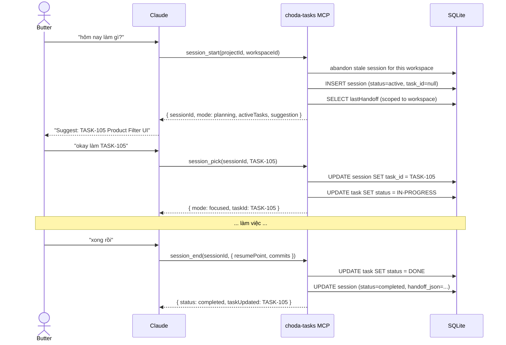
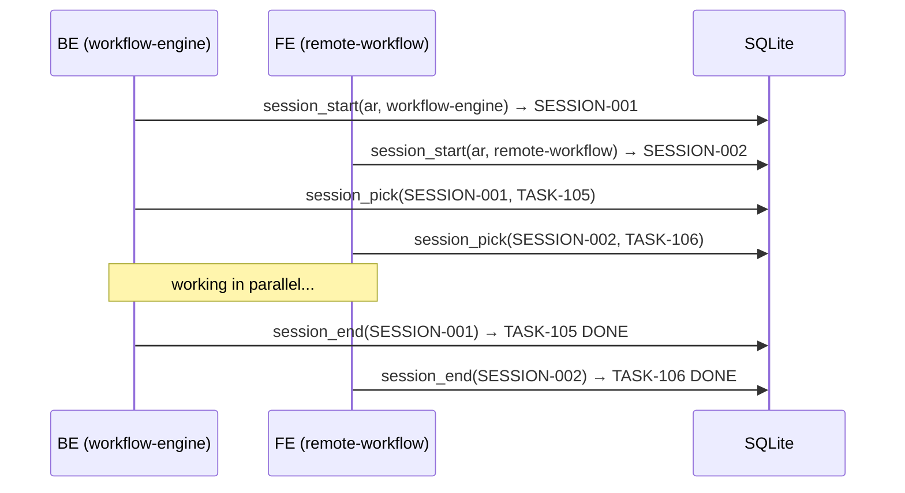

# ADR-009: Session Lifecycle — workspace-scoped, task-bound sessions

## Context

ADR-008 defined L3 (Session Lifecycle) as: "Auto-handoff at session end, auto-resume at session start. Claude Code never starts cold."

ADR-006 established: Project owns tasks, Workspace owns terminal. A project like `automation-rule` has multiple workspaces (`workflow-engine` BE, `remote-workflow` FE).

Real usage pattern: developer runs 2-3 Claude sessions in parallel, one per workspace, each working on a different task. Session must be scoped to workspace, not project.

## Decision

Session lifecycle is implemented as **three tools + one SQLite table**:

### Tools

| Tool | When called | What it does |
|---|---|---|
| `session_start(projectId, workspaceId?)` | Beginning of work | Creates session (planning mode), abandons stale session for this workspace, returns last handoff + active tasks |
| `session_pick(sessionId, taskId)` | After picking a task | Binds task to session (focused mode), sets task IN-PROGRESS. WIP=1. |
| `session_end(sessionId, handoff)` | Task done or end of work | Marks task DONE (if bound), persists handoff to SQLite |

### SQLite schema

```sql
CREATE TABLE sessions (
  id           TEXT PRIMARY KEY,
  project_id   TEXT NOT NULL,
  workspace_id TEXT,
  task_id      TEXT,
  started_at   TEXT NOT NULL,
  ended_at     TEXT,
  status       TEXT NOT NULL DEFAULT 'active',
  handoff_json TEXT,
  created_at   TEXT NOT NULL DEFAULT (datetime('now')),
  FOREIGN KEY (project_id) REFERENCES projects(id)
)
```

### Session modes

| Mode | Condition | Meaning |
|---|---|---|
| Planning | `active`, `task_id = null` | Reviewing tasks, deciding what to work on |
| Focused | `active`, `task_id set` | Working on a specific task (WIP=1) |
| Completed | `status = completed` | Task done → session auto-closed |

### Flow



### Parallel workspaces



### Guard rules

1. **1 active session per workspace per project** — `session_start` abandons stale session for the same workspace
2. **WIP=1** — `session_pick` rejects if session already has a task
3. **Task → DONE on session_end** — if session has a bound task, it is automatically marked DONE
4. **Handoff scoped to workspace** — `loadLastHandoff` filters by workspace, so BE and FE have independent resume points

### Source of truth

SQLite only. No .md export (removed per ADR-010 pattern — AI reads via MCP tools, human reads via Choda Deck UI).

## Status rules

| Status | Meaning |
|---|---|
| `active` | Session in progress — 1 per workspace per project |
| `completed` | Ended normally via `session_end` — has handoff_json |
| `abandoned` | Killed by next `session_start` — handoff_json null |

## Consequences

- Sessions are workspace-scoped, enabling parallel work across BE/FE
- `session_pick` enforces Kanban WIP=1 — no multi-tasking within a workspace
- Task lifecycle tied to session: pick → IN-PROGRESS, end → DONE
- Planning mode allows exploration before committing to a task
- `/handoff` skill should call `session_end` to persist handoff

## Related

- [[ADR-006-project-workspace-hierarchy]] — Project vs Workspace separation
- [[ADR-008-ai-workflow-engine-pivot]] — defines L3 as a layer
- [[ADR-010-conversation-protocol]] — same SQLite-only pattern, no .md export
- [[ADR-004-sqlite-task-management]] — SQLite foundation
