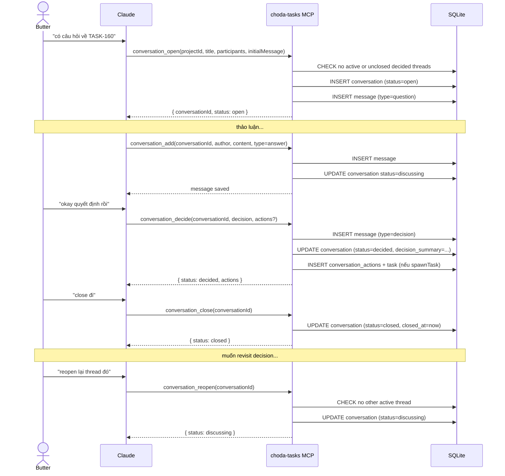
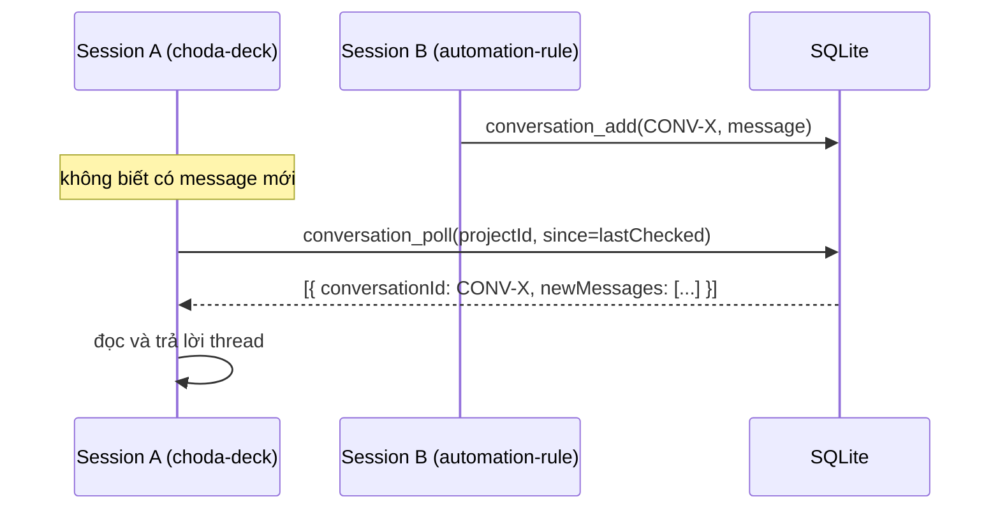

# ADR-010: Conversation Protocol — SQLite-only, no .md export

## Context

ADR-008 defined L2 (Conversation & Decision Tracking) as: "First-class conversation threads linked to tasks and ADRs. Replaces manual conversation.md."

Before this decision, conversations were tracked manually in `conversation.md` — free-form markdown with no structure, not queryable, and requiring manual maintenance.

The initial M1 implementation (TASK-504) shipped `conversation_open/add/decide` MCP tools with automatic export to `conversation.md` on every mutation. This was a transitional approach — keeping the file-based pattern alive while building the SQLite layer.

After dogfooding with the automation-rule project, the export was reconsidered:

- AI reads conversations via `conversation_read` / `conversation_list` — file not needed
- `project_context` aggregates open conversations directly from SQLite
- Export on every `conversation_add` adds overhead with no value
- `conversation.md` is overwritten on every mutation — not useful for human reading either
- Choda Deck UI will replace Obsidian for human reading

## Decision

**Conversations are stored in SQLite only. No .md export.**

### Tools

| Tool | What it does |
|---|---|
| `conversation_open` | Create thread, add initial message, link tasks. **Guarded**: rejects if active thread exists or unclosed decided threads remain. |
| `conversation_add` | Add message to thread (question / answer / proposal / review / action / comment) |
| `conversation_decide` | Record decision, set status=decided, optionally spawn tasks |
| `conversation_close` | Close a decided conversation (status → closed). Must close before opening new thread. |
| `conversation_reopen` | Reopen a decided conversation back to discussing. Only if no other active thread. |
| `conversation_list` | List conversations for a project, filter by status or participant |
| `conversation_read` | Read full thread: messages + participants + actions + links |
| `conversation_poll` | Poll for new messages since a timestamp — detects cross-session activity |

### SQLite schema (key tables)

```sql
conversations (id, project_id, title, status, created_by, decision_summary, decided_at, ...)
conversation_participants (conversation_id, name, type, role)
conversation_messages (id, conversation_id, author_name, content, message_type, metadata_json, ...)
conversation_actions (id, conversation_id, assignee, description, status, linked_task_id, ...)
conversation_links (conversation_id, linked_type, linked_id)
```

### Status flow

```
open → discussing → decided → closed (closed)
          ↑            │    ↘ stale
          └────────────┘
           (reopen)
```

Rules:
- `conversation_add` auto-transitions `open → discussing`
- `conversation_decide` transitions `discussing → decided`
- `conversation_close` transitions `decided → closed`
- `conversation_reopen` transitions `decided → discussing` (only if no active thread)

### Concurrency guards (1 active thread per project)

1. **Only 1 open/discussing conversation per project** — `conversation_open` rejects if one exists
2. **Decided threads must be closed before opening new** — `conversation_open` rejects if unclosed decided threads remain
3. **Reopen respects the same rule** — `conversation_reopen` rejects if another thread is active

### Sequence diagram — full lifecycle



### Cross-session polling



## Why no .md export

| Concern | Resolution |
|---|---|
| AI cần đọc conversation | `conversation_read` / `conversation_list` đủ |
| Human cần đọc | Choda Deck UI (roadmap) — planned |
| Cross-session visibility | `conversation_poll` — detect messages từ session khác |
| Obsidian fallback | Not needed — Choda Deck thay thế use case này |

## Consequences

- `conversation-exporter.ts` không còn được gọi — có thể xóa khi cleanup
- `conversation.md` trong vault không còn được cập nhật — existing files là historical only
- Cross-session collaboration yêu cầu chủ động poll (`conversation_poll`) hoặc manual `conversation_list`
- `project_context` trả về `openConversations` với 3 messages gần nhất — đủ để Claude biết context khi bắt đầu session

## Related

- [[ADR-008-ai-workflow-engine-pivot]] — defines L2 as a layer
- [[ADR-009-session-lifecycle]] — L3 session, same SQLite-only pattern
- [[ADR-004-sqlite-task-management]] — SQLite foundation
