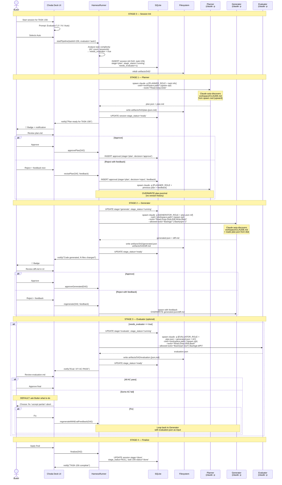

# ADR-014: Staged Pipeline Harness — Planner → Generator → Evaluator with Approval Gates

> **SUPERSEDED 2026-04-23** — Butter switched to Claude Code `/team` (native sub-agent orchestration). Self-written harness (`src/core/harness/*`, stage-runner, planner/generator/evaluator subprocesses, approval gates, budget caps) removed via PR #25 (commit `510ff0b`). Tracking tasks TASK-577 and TASK-527 deleted. This ADR is preserved for historical context only — do not implement.

## Context

[[ADR-008-ai-workflow-engine-pivot]] established the 5-layer vision. L4 = Harness Engine: the execution runtime turning tasks into Claude sessions.

This ADR went through three design iterations before settling:

1. **Autonomous Planner/Generator/Evaluator** — rejected. Duplicates Claude's internal reasoning, violates ADR-013 soft-enforcement (Evaluator = hard validation), violates ADR-008 layer separation (blurs L4 execution with L5 quality).
2. **Thin harness over single `claude -p`** — rejected after Butter feedback. Works but offers no visibility into Claude's reasoning; debugging a bad run means reading conversation logs; no structured way to course-correct mid-task.
3. **Staged pipeline with human approval gates** — accepted. Keeps human-in-the-loop at every handoff, produces structured artifacts for review, aligns with "Butter is backstop" while giving Butter concrete things to approve.

The key insight driving iteration 3: **Choda Deck is personalization-AI for Butter, not autonomous agent infrastructure.** Butter wants assistance, not replacement. Approval gates make the pipeline a thinking tool, not a black box.

## Decision

**Harness implements a 3-stage pipeline with human approval gates between stages.** Each stage is a separate `claude -p` subprocess spawned in the project workspace. A single Choda Deck session wraps all stages. Butter approves at each handoff.

### Pipeline overview

```
Butter → Start session for TASK-xxx
          ↓
      [Evaluator?] Yes / No / Auto (based on task complexity)
          ↓
  ┌─── STAGE 1: PLANNER (claude -p #1) ───┐
  │    Input:  task + AC + project CLAUDE.md
  │    Output: plan.json + plan.md
  │    Tools:  Read, Grep, Glob (read-only)
  └─────────────── 🔔 APPROVAL GATE ──────┘
          ↓
  ┌─── STAGE 2: GENERATOR (claude -p #2) ─┐
  │    Input:  plan.json + project CLAUDE.md
  │    Output: generated.json + diff.md
  │    Tools:  Read, Edit, Write, Bash (full)
  └─────────────── 🔔 APPROVAL GATE ──────┘
          ↓
  ┌─── STAGE 3: EVALUATOR (claude -p #3) ─┐ (optional)
  │    Input:  plan + generated + AC + CLAUDE.md
  │    Output: evaluation.json + evaluation.md
  │    Tools:  Read, Grep, Glob (read-only)
  └─────────────── 🔔 APPROVAL GATE ──────┘
          ↓
      Finalize: session_end, task → done
```

### Sequence diagram



### Session and Claude process model

- **1 Choda Deck session** (`sessions.id = S42`) wraps the entire pipeline for one task.
- **3 Claude processes** spawned sequentially, one per stage.
- **No `claude --resume`** between stages — each `claude -p` is fresh. Resume would reload entire prior conversation into context per spawn, growing token cost linearly with session length.
- **Context flows via files**, not via Claude internal state. `cwd` is set through Node `spawn({ cwd: workspace.path })` (an OS process option, not a CLI flag — Claude CLI has no `--cwd`). Claude auto-discovers `CLAUDE.md` by **walking up the parent directory tree** from cwd — confirmed TASK-537 Test 1. Choice of `workspace.path` must account for this (see "Workspace path isolation" below).
  - Planner reads `CLAUDE.md` (auto-discovered from spawn cwd) + task info (from stdin via `-p`)
  - Generator reads `CLAUDE.md` + `plan.json` (from disk)
  - Evaluator reads `CLAUDE.md` + `plan.json` + `generated.json` + AC

This is deliberate. Claude's internal session state is a black box; files are inspectable, diffable, replayable.

### Hermetic spawn contract

Every HarnessRunner spawn MUST include these flags (non-negotiable for pipeline isolation, confirmed by TASK-537 spike):

| Flag | Why |
|---|---|
| `--setting-sources user` | Prevents workspace `.claude/settings.local.json` (env vars, permissions) from leaking into pipeline behavior. Without this, Butter editing workspace settings silently changes pipeline output. Confirmed via Test 7. |
| `--no-session-persistence` | No `.jsonl` session transcript written to `~/.claude/projects/`. Pipeline runs don't pollute Butter's `/resume` picker. Caveat: empty `memory/` dir shell still created per cwd (no files inside, no data persisted). Acceptable residue — no active cleanup in v1. |
| `--output-format json` | Parseable output with `total_cost_usd`, `duration_ms`, `usage`, `result` fields. Required for ledger + artifact extraction. |
| `--model <explicit>` | Do not inherit from user config. Pipeline model choice is a Choda Deck decision per stage (e.g. Sonnet for Planner, Opus for Evaluator). |

Prompt delivery: **stdin, not argv**. Piping `rolePrompt + inputs` via `proc.stdin` avoids the Windows 32KB argv limit and cmd.exe escaping pitfalls. See "Windows spawn caveat" below.

### Workspace path isolation

Because Claude walks up parent dirs reading every `CLAUDE.md` it finds (TASK-537 Test 1), `workspace.path` choice affects what context the pipeline sees.

**Pattern: spawn into a git worktree.** Workspaces live at paths like:

```
C:\dev\<repo>\                           ← main checkout
C:\dev\<repo>.worktrees\<branch>\        ← HarnessRunner pipelines spawn here
```

Parent chain of a worktree path (`C:\dev\<repo>.worktrees\feat-x\`):
- `C:\dev\<repo>.worktrees\feat-x\CLAUDE.md` ← worktree's own (from branch)
- `C:\dev\<repo>.worktrees\` ← has no CLAUDE.md
- `C:\dev\` ← has no CLAUDE.md
- `C:\` ← has no CLAUDE.md

No parent leak. Confirmed TASK-537 Test 9: spawn with `cwd = C:\dev\choda-deck.worktrees\task-537-spike\` resolved `git rev-parse --show-toplevel` to the worktree, `git branch --show-current` to the pipeline branch, and loaded only the worktree's CLAUDE.md.

**Avoid** spawning into paths with CLAUDE.md ancestors (e.g. a subdirectory inside `<repo>/` where the parent repo's CLAUDE.md would be pulled in on top of the stage's intended context).

If a workspace cannot be isolated (rare), fall back to `--bare` + explicit `--add-dir <workspace>`. `--bare` disables CLAUDE.md auto-discovery entirely; `--add-dir` whitelists directories. More ceremony — only use when the natural cwd is not hermetic.

### Windows spawn caveat

Confirmed in TASK-537 spike. Two interacting Windows-specific traps:

1. **Node 20+ blocks spawning `.cmd` files without `shell: true`** (CVE-2024-27980 mitigation). HarnessRunner targets Claude CLI which on Windows is `claude.cmd`. Direct `spawn('claude.cmd', args, { shell: false })` throws.
2. **`shell: true` does NOT escape args** — Node concatenates argv with spaces and hands the string to `cmd.exe /d /s /c`. Args with cmd metacharacters (`( ) < > & | ^ " * ?`) get reinterpreted. Tool patterns like `Bash(git *)` and any prompt with quotes/braces get mangled.

Implementation requirement: HarnessRunner must build the command line itself with cmd.exe-safe quoting. Reference helper used in spike:

```ts
function quoteArg(a: string): string {
  if (/[\s()<>&|^"*?]/.test(a)) return `"${a.replace(/"/g, '\\"')}"`
  return a
}
const cmdLine = `"${CLAUDE_CMD}" ${args.map(quoteArg).join(' ')}`
spawn(cmdLine, { cwd, shell: true, stdio: ['pipe', 'pipe', 'pipe'] })
```

This logic lives in `src/core/harness/spawn-utils.ts` (Phase 1). Cross-platform abstraction: on POSIX, use `spawn(CLAUDE_BIN, args, { cwd })` directly with `shell: false` — no quoting needed. Branch on `process.platform`.

### Why not `claude -p --session-id` / `--resume`?

Primary reason: **token cost.** `--resume` reloads the entire prior conversation history into context on every spawn. A 3-stage pipeline with revisions would see per-stage token usage grow linearly with cumulative session length — cost explodes fast under Butter's usage pattern. File-based handoff keeps each stage's context narrow and bounded.

Secondary concerns (historical, may be resolved in current Claude Code builds):
- `--session-id` flag behaviour per GitHub anthropics/claude-code#44607 — flag value was not honoured as the actual session ID; real IDs came from `.jsonl` filenames under `~/.claude/projects/<encoded-path>/`. Any workaround would couple Choda Deck to Claude Code's internal file layout.

**Choda Deck owns session identity.** `sessions.id` is the only session ID that matters. Claude's internal IDs are implementation detail we don't track. When a stage needs context, Choda Deck provides it via files — no Claude-side resume required.

### CLAUDE.md: project facts, not role behavior

Each workspace has a manually-maintained `CLAUDE.md` describing project facts:

```markdown
# Project: workflow-engine

## Stack
- .NET 10, Orleans, PostgreSQL, Redis
- React + React Flow frontend

## Conventions
- OpenAPI-first via NSwag (never manually write frontend API types)
- Conventional commits: feat/TASK-XXX, fix/TASK-XXX

## Constraints
- 80% test coverage for core/
```

**Rule: CLAUDE.md contains facts, never behavior.** What the project IS, not what Claude should DO.

Role behavior (what Planner/Generator/Evaluator should do) lives in Choda Deck's code as role prompts injected via stdin:

```typescript
// src/core/harness/prompts.ts
const PLANNER_ROLE = `
You are analyzing a task to create an implementation plan.
- Read CLAUDE.md for project context
- Output plan.json (structured) and plan.md (human-readable)
- DO NOT write code
- DO NOT modify any files
- Focus on: files to touch, ordered steps, risks, dependencies
`

const GENERATOR_ROLE = `
You are implementing an already-approved plan.
- Read CLAUDE.md for project context
- Read plan.json for the approved plan
- Follow the plan exactly; if unclear, STOP and report
- Output generated.json (file changes) + diff.md (for review)
- DO apply changes to files
`

const EVALUATOR_ROLE = `
You are verifying generated code against acceptance criteria.
- Read CLAUDE.md for project context
- Read plan.json, generated.json, and the task AC list
- DO NOT modify any files
- Output evaluation.json: per-AC PASS/FAIL with concrete evidence
- Be strict: partial implementation = FAIL
`
```

Separation:
- **CLAUDE.md** = per-project, manually maintained by Butter, lives in workspace, committed to git.
- **Role prompts** = global, owned by Choda Deck code, versioned with Choda Deck releases.

**Prompt delivery mechanism:** HarnessRunner pipes the role prompt + inputs into Claude via **stdin** (`proc.stdin.write(...)` then `end()`), not as a positional argv argument. Confirmed by TASK-537 spike: `-p` mode reads stdin by default (default `--input-format text`), and stderr shows `"no stdin data received in 3s, proceeding without it"` if not fed. Rationale: avoids the Windows 32KB argv limit and `cmd.exe` escaping pitfalls (see "Windows spawn caveat" below). Stages with very large inputs still put the bulk on disk and reference paths in the prompt; Claude's Read tool loads them inside the session.

Claude Code `interactive` sessions outside the pipeline still read `CLAUDE.md` normally — they just never see the role prompts (role prompts apply only to harness-spawned `-p` sessions).

### Tool loading + pre-approval per stage

Two Claude CLI flags with different purposes (confirmed by TASK-537 spike):

- `--tools <list>` (comma-separated) — **restricts which tools are loaded**. Tools outside this list are not available at all. This is the real safety gate.
- `--allowed-tools <list>` (space- or comma-separated) — **pre-approves** specific tools or scoped patterns so Claude runs them without permission prompts. In `-p` mode there is no human to prompt, so this flag alone does NOT restrict — `--tools` is the enforcement mechanism.

Bash subcommand pattern syntax: **space inside parens** (`Bash(git *)`), not colon.

| Stage | `--tools` (restrict loaded set) | `--allowed-tools` (pre-approve, no prompt) | Rationale |
|---|---|---|---|
| Planner | `Read,Grep,Glob` | (none — all loaded tools are read-only, pre-approve unnecessary) | Planning must not modify anything |
| Generator | `Read,Grep,Glob,Edit,Write,Bash` | `Bash(git *) Bash(npm *) Bash(npx *)` | Full edit access; Bash scoped to safe subcommands. Bare `Bash` would allow `rm`, `curl`, `git push` |
| Evaluator | `Read,Grep,Glob,Bash` | `Bash(npm test*) Bash(git diff*)` | Read-only plus bounded test/diff execution for AC verification |

If a stage needs tools outside its allowlist, it surfaces a blocked-tool message and Butter approves via UI (one-shot) or permanently widens the allowlist for future runs.

### Approval flow

At each gate, Butter has three options:

| Action | Meaning | Effect |
|---|---|---|
| **Approve** | Output is good, proceed | Advance to next stage |
| **Reject with feedback** | Re-run this stage with my notes | Respawn stage; **overwrite** artifact (no version history) |
| **Abort** | Cancel the pipeline | Mark session `aborted`, task stays in prior status |

**Revision strategy: overwrite, not version.** When Butter rejects a plan, the next Planner run overwrites `plan.json` / `plan.md`. Rationale: keeps filesystem clean, audit trail lives in `pipeline_approvals` table (records every decision + feedback text).

**Butter does NOT edit artifacts directly.** All approval/rejection happens through the Choda Deck UI. If Butter wants changes, Butter writes feedback text; the next Claude run integrates it. This preserves clean provenance: every artifact is Claude-generated, every decision is Butter-recorded.

### Evaluator feedback loop

If Evaluator reports any AC as FAIL:

**Default (configurable per session):** Butter decides — UI presents three options:
- **Fix** — loop back to Generator with evaluation.json as additional input
- **Accept partial** — mark task done despite failing AC (with note)
- **Abort** — mark task blocked, keep artifacts for later review

Not auto-looping. Butter in the loop for judgment calls — "this AC is actually wrong, not the code".

Per-session setting: Butter can pre-select default ("always fix on fail") at pipeline start, overridable per occurrence.

### Schema

```sql
-- Extend sessions table (additive migration).
-- Pipeline state is split into two columns: stage (which phase) × stage_status (status within it).
-- Rationale: a single merged enum of 10 values (planning|plan_ready|plan_approved|generating|...) explodes
-- combinatorially and makes queries like "all sessions awaiting approval" awkward. Two orthogonal columns
-- keep queries simple ("WHERE stage_status='ready'") and make invalid combinations impossible by design.
ALTER TABLE sessions ADD COLUMN pipeline_stage TEXT;
-- values: 'plan' | 'generate' | 'evaluate' | 'done' | 'aborted'

ALTER TABLE sessions ADD COLUMN pipeline_stage_status TEXT;
-- values: 'running' | 'ready' | 'approved' | 'rejected'
-- ('running' = stage in progress; 'ready' = awaiting Butter approval;
--  'approved' = gate passed, next stage about to start; 'rejected' = revision pending)
-- Terminal stages 'done' and 'aborted' leave pipeline_stage_status NULL.

ALTER TABLE sessions ADD COLUMN needs_evaluator INTEGER NOT NULL DEFAULT 0;
ALTER TABLE sessions ADD COLUMN current_iteration INTEGER NOT NULL DEFAULT 0;

-- New table: approval audit trail
CREATE TABLE pipeline_approvals (
  id           INTEGER PRIMARY KEY AUTOINCREMENT,
  session_id   TEXT NOT NULL,
  stage        TEXT NOT NULL,        -- 'plan' | 'generate' | 'evaluate' (matches sessions.pipeline_stage)
  iteration    INTEGER NOT NULL,
  decision     TEXT NOT NULL,        -- 'approve' | 'reject' | 'abort'
  feedback     TEXT,                 -- nullable, present for 'reject'
  created_at   TEXT NOT NULL DEFAULT (datetime('now')),
  FOREIGN KEY (session_id) REFERENCES sessions(id)
);

CREATE INDEX idx_approvals_session ON pipeline_approvals(session_id);

-- Attribution for conversation concurrency (R3)
ALTER TABLE conversations ADD COLUMN owner_session_id TEXT;
ALTER TABLE conversations ADD COLUMN owner_type TEXT; -- 'pipeline' | 'interactive'
CREATE INDEX idx_conversations_owner_session ON conversations(owner_session_id);
```

### Artifact layout

```
<choda-deck-data>/
└── artifacts/
    └── S42/                    ← session ID
        ├── plan.json           ← Planner output (structured)
        ├── plan.md             ← Planner output (Butter reads this)
        ├── generated.json      ← Generator output (file changes manifest)
        ├── diff.md             ← Generator output (Butter reviews this)
        ├── evaluation.json     ← Evaluator output (optional)
        └── evaluation.md       ← Evaluator output (optional)
```

All artifacts overwrite on revision. Approval history is the audit log.

### HarnessRunner implementation sketch

Single `HarnessRunner` singleton in Electron main process.

```typescript
class HarnessRunner {
  private sessions: Map<SessionId, PipelineState> = new Map()
  private readonly MAX_CONCURRENT_SESSIONS = 3

  async startPipeline(taskId: string, opts: PipelineOpts) { /* ... */ }
  async approveStage(sessionId: string) { /* ... */ }
  async rejectStage(sessionId: string, feedback: string) { /* ... */ }
  async abort(sessionId: string) { /* ... */ }

  private async runStage(
    sessionId: string,
    stage: 'planner' | 'generator' | 'evaluator'
  ) {
    const session = this.sessions.get(sessionId)!
    const workspace = await db.getWorkspace(session.workspaceId)
    const rolePrompt = ROLE_PROMPTS[stage]
    const inputs = await this.gatherInputs(session, stage)

    const proc = spawn(CLAUDE_CMD, [
      '-p',
      '--model', STAGE_MODEL[stage],                 // explicit, don't inherit
      '--output-format', 'json',
      '--no-session-persistence',                    // no /resume picker pollution
      '--setting-sources', 'user',                   // block workspace settings.local.json leak
      '--tools', TOOL_LOAD_LIST[stage],              // comma-sep: 'Read,Grep,Glob'
      '--allowed-tools', ...TOOL_PREAPPROVE[stage],  // e.g. 'Bash(git *)' 'Bash(npm *)'
      '--max-budget-usd', String(STAGE_BUDGET[stage]),
    ], {
      cwd: workspace.path,  // Node spawn option — Claude auto-discovers CLAUDE.md upward
      stdio: ['pipe', 'pipe', 'pipe'],
    })
    // Prompt via stdin (not argv) — Windows 32KB argv limit + cmd.exe escaping
    proc.stdin.write(`${rolePrompt}\n\n${inputs}`)
    proc.stdin.end()

    const result = await this.collectOutput(proc)
    await this.writeArtifact(sessionId, stage, result)
    await this.notifyButter(sessionId, stage)
  }
}
```

## Rationale

- **Human-in-the-loop is Choda Deck's core value.** Butter is the architect; Claude is the implementer. Approval gates keep Butter in judgment positions, not typing positions.
- **Structured artifacts > conversation logs.** `plan.json` / `generated.json` / `evaluation.json` are inspectable, diffable, replayable. Beats scrolling through a 2000-turn conversation to find what went wrong.
- **Stage isolation = debuggability.** Bad plan → replace Planner. Bad generation → replace Generator. Bad eval → replace Evaluator. Each stage independently swappable.
- **CLAUDE.md reuse = zero duplication.** Choda Deck does not rebuild project context per call; Claude auto-discovers `CLAUDE.md` from the spawn cwd (Node `spawn({ cwd })` option — Claude CLI has no `--cwd` flag).
- **Tool allowlist per stage = safety.** Planner/Evaluator cannot accidentally modify code. Generator is where mutation happens, scoped tightly.
- **Files over Claude session state = portability.** Choda Deck not coupled to Claude Code's session file format (unlike the `--session-id` workaround investigated earlier).

## Consequences

### Positive

- Butter reviews concrete artifacts (plan.md, diff.md, evaluation.md) instead of raw Claude output.
- Each stage's scope is narrow → Claude performs better on focused prompts than on open-ended "do the whole task".
- Pipeline extensible: adding a Security Review stage = 1 new role prompt + 1 new gate, no rewrite.
- Token-efficient: narrow per-stage context beats one long session accumulating irrelevant history.
- Zero Choda-side state about Claude internals — upgrade-resistant.

### Negative

- Approval fatigue is real. 3 gates per task tempts "rubber stamp" clicks that defeat the purpose. Mitigation: Evaluator is optional; `execution_mode=direct` for trivial tasks bypasses pipeline entirely.
- Pipeline pauses when Butter is offline. Acceptable for personal tool; not for team/production.
- Context drift between stages. Planner's mental model ≠ Generator's mental model. Mitigation: `plan.json` must be detailed and structured enough that Generator has no ambiguity.
- More artifacts to manage on disk. Mitigation: cleanup policy for completed sessions (retain N most recent, archive older).
- Not suitable for trivial tasks (typo fix, rename). Mitigation: keep `execution_mode=direct` as escape hatch.

### Out of scope (deferred)

- Automated loop-on-eval-fail without Butter approval (violates human-in-the-loop principle).
- Direct in-UI editing of plan.md / diff.md (adds complexity; feedback-text flow is sufficient).
- Version history of artifacts across revisions (audit trail via `pipeline_approvals` is sufficient).
- Parallel stages (all stages sequential by design; parallelism across tasks, not within).
- Cross-session pipeline linking (e.g. "use plan from S40 as starting point for S42").

## Risks

### ✅ Resolved

**R1. Claude session identity management — RESOLVED**

Decision: Choda Deck owns session identity via `sessions.id`. Claude's internal session IDs are not tracked. Context flows via files (plan.json, generated.json) and via Node `spawn({ cwd: workspace.path })` so Claude auto-discovers workspace `CLAUDE.md`. Workspace path must be hermetic (no CLAUDE.md ancestors) — see "Workspace path isolation" section. The git worktree pattern (`C:\dev\<repo>.worktrees\<branch>\`) is the standard choice.

Rejected earlier workaround: `--session-id` + directory snapshot diff (per GitHub anthropics/claude-code#44607). Too fragile, couples to Claude Code's file layout.

**R2. HarnessRunner instance model — RESOLVED**

Decision: One `HarnessRunner` singleton in Electron main, `MAX_CONCURRENT_SESSIONS = 3`.

Rationale: WIP=1 at session layer (ADR-009); main process single-threaded; Max-plan rate limits need central visibility.

Escape hatch: migrate to `utilityProcess.fork()` if long-running stages block main event loop. MVP stays in main.

**R3. Conversation concurrency — RESOLVED (reframed from "lock")**

Decision: No new lock table. Use ownership attribution on `conversations` table (see schema).

ADR-010 already guarantees "1 active thread per project". Real issue was UX when `conversation_open` gets rejected — caller didn't know who owned the thread. Attribution columns + ADR-013-style rule text solve this without a new lock primitive.

Rule text added to `conversation_open` MCP tool description:

```markdown
## On conversation_open reject

When rejected because an active thread exists, the error payload includes:
- owner_type: 'pipeline' | 'interactive'
- owner_session_id
- owner_task_id (if bound)
- started_at

Present to user:
- owner_type=pipeline: "Pipeline đang chạy task <id>. Wait, hoặc abort pipeline."
- owner_type=interactive: "Bạn có thread mở ở session khác. Close trước."
```

**Reverse direction — starting pipeline while an interactive thread is open:**

`startPipeline` checks the same attribution row before spawning any stage. If an interactive thread is active on the target project, the call is rejected with the same payload shape. UI surfaces one of two options to Butter:
- **Close interactive thread and start pipeline** — calls `conversation_close` on the interactive thread, then retries `startPipeline`.
- **Cancel** — abort the pipeline request; interactive thread untouched.

No auto-close. Explicit choice preserves the "Butter is backstop" principle — Choda Deck never silently evicts a conversation Butter may still want.

### 🟡 Accept for MVP

**R4. Approval fatigue**
- 3 gates × N tasks/day → gate-clicking becomes reflex.
- Mitigation: `execution_mode=direct` for trivial tasks; Evaluator opt-in; UI design makes artifacts fast to scan (plan.md headings, diff.md syntax highlight).

**R5. Plan ambiguity → Generator drift**
- Generator doesn't share Claude session with Planner; relies solely on `plan.json` quality.
- Mitigation: strict Planner role prompt demands enumerated steps, file paths, ordering. Consider adding `plan.schema.json` validator to reject vague plans at the gate.

**R6. Staleness of role prompts across model upgrades**
- Prompts tuned for Claude 4.x may regress on Claude 5+.
- Mitigation: prompts live in `src/core/harness/prompts.ts`, versioned with Choda Deck. Part of release discipline to re-validate on model upgrade.

**R7. Workspace state mutation between stages**
- Generator changes files. If Butter edits those files between Generator approval and Evaluator run, Evaluator sees inconsistent state.
- Mitigation (git workspace): checkpoint git commit after Generator approval; Evaluator operates on that commit; revert if aborted.
- Mitigation (non-git workspace): snapshot the set of files listed in `generated.json` into `artifacts/<session>/snapshot/` after Generator approval; Evaluator reads from the snapshot, not the live workspace. Abort = discard snapshot, no workspace changes to revert.
- HarnessRunner detects workspace type on session start (`git rev-parse --is-inside-work-tree` exit code). Choice is per-workspace, not a runtime option.

**R8. SQLite contention under parallel sessions**
- 3 concurrent pipelines writing approvals + artifacts metadata. WAL mode sufficient for MVP.
- Fallback: serialize writes through main process queue.

### 🟢 Low

**R9. Budget cap (soft)** — `--max-budget-usd N` is enforced AFTER each turn, not mid-turn. Actual spend can exceed cap by ~2x before Claude aborts (confirmed TASK-537 Test 4: cap $0.02, actual $0.047). To bound worst-case spend at target $X, set `--max-budget-usd` to approximately `X/2`. Track authoritative cost via `total_cost_usd` in the JSON output; do not rely on the cap value as the ledger figure.

Per-stage budget target vs cap:

| Stage | Target worst-case | `--max-budget-usd` cap |
|---|---|---|
| Planner | $0.50 | `0.25` |
| Generator | $2.00 | `1.00` |
| Evaluator | $0.50 | `0.25` |

Abort on cap: Claude exits non-zero; HarnessRunner records `pipeline_approvals` row with `decision='abort'` + reason.

**R10. Artifact disk growth** — retention: 30 most recent sessions kept; older archived to `artifacts/_archive/`.

**R11. Kill semantics** — SIGTERM → 10s grace → SIGKILL. Partial artifacts discarded; approval row records `aborted`.

**R12. Tool allowlist drift** — if Anthropic adds new tools, allowlist may become incomplete. Accept: update on demand.

## Open questions (and resolved)

**Q1. Direct mode threshold — RESOLVED (deferred to Phase 4)**

Decision: MVP (Phase 1-3) has no direct mode. Every task goes through the Planner gate, including typos. Butter can reject the plan immediately to abort — cost of the skip: one Planner spawn (~30s, <$0.10).

Rationale: any "trivial vs non-trivial" heuristic (AC count, keyword match, files_hint) has too many edge cases to trust without usage data. AC count does not predict complexity; keyword matching is noisy in both directions. Cheaper to always run Planner and let Butter reject in one click than to debug mis-classification.

Direct mode is an optimization, not a feature. Defer to Phase 4 with real usage data to tune the heuristic against actual task patterns.

**Q2. Evaluator auto-selection — RESOLVED**

Decision: When Butter selects "Auto" at stage 0, `needs_evaluator = true` iff the task title or any AC contains a trigger keyword:

```typescript
// src/core/harness/evaluator-triggers.ts
export const EVALUATOR_TRIGGER_KEYWORDS = [
  'security', 'auth', 'authentication', 'authorization',
  'migration', 'schema', 'database',
  'payment', 'billing',
  'permission', 'access control',
]
```

No match → `needs_evaluator = false`. Butter can override manually at stage 0.

Rationale: AC count is a noisy signal — Butter often breaks tasks into many small ACs that are individually trivial. Keywords target high-stake domains (data loss, security breach, financial risk) where a verification stage earns its cost. False positive = one extra Evaluator spawn (~1 min, ~$0.20), acceptable. False negative = Butter enables manually.

Keyword list is data, not architecture — live in `src/core/harness/evaluator-triggers.ts`, added/removed without ADR revision.

**Q3. Notification channel**
- MVP: in-app badge + Electron native notification.
- Later: desktop sound? Telegram? Defer.

**Q4. Pipeline abort cleanup**
- Abort mid-Generator leaves modified files. Auto-revert Git? Prompt Butter?
- Proposed: prompt Butter — "revert N files?" with per-file checkboxes.

**Q5. Stage timeout defaults**
- Planner: 2 min
- Generator: 10 min (can run long for large changes)
- Evaluator: 3 min
- Timeout → mark stage `timed_out`, Butter decides retry/abort.

## Implementation phases

Validate incrementally. Do NOT build all 3 stages at once.

**Phase 1 — Planner only (MVP)**
- Single stage + 1 approval gate
- Butter approves plan.md → **implements manually via a separate interactive Claude session** (spawned by Butter in their own terminal, outside HarnessRunner). The plan serves as the brief; the resulting source code is not a pipeline artifact in Phase 1.
- Clarifies the "Butter does NOT edit artifacts directly" rule: it applies to pipeline-generated artifacts (plan.md, diff.md, evaluation.md). Source code written by Butter via an interactive session is not a pipeline artifact.
- Validates: stage isolation, artifact workflow, approval UI, notification
- Goal: prove the pipeline model works end-to-end with zero code-modification risk

**Phase 2 — Add Generator**
- 2 stages + 2 gates
- Evaluator deferred; Butter manually reviews diff.md
- Validates: file-based context handoff (plan → generator), diff rendering UI

**Phase 3 — Add Evaluator**
- Full 3-stage pipeline
- Eval failure loop with Butter decision
- Validates: cross-stage artifact flow, AC verification quality

**Phase 4 — Polish**
- `execution_mode=direct` escape hatch — evaluate after usage data accumulates (see Q1)
- Artifact retention policy
- Git checkpointing (R7)
- Tune evaluator trigger keyword list based on usage (Q2 resolved for MVP with initial keyword set)

## Considered alternatives

### Alt 1 — Autonomous Planner/Generator/Evaluator (rejected)

The first exploratory draft. 3 agents chained automatically, Evaluator re-loops Generator on AC failure, no human involvement until end. Rejected because:

- Duplicates Claude's internal reasoning for no gain
- Violates ADR-013 soft-enforcement (Evaluator = hard validation)
- Token-expensive (3 LLM calls per task minimum, N iterations on fail)
- Fragile to model upgrades (prompts go stale)
- "Black box" — Butter has no visibility until done, hard to course-correct

### Alt 2 — Thin harness over single `claude -p` (rejected)

Proposed in `harness-design-draft.md` and in the second draft of this ADR. Harness = process manager + DB logger. One `claude -p` session per task; Claude self-plans, self-implements, self-verifies via ADR-013 rules.

Rejected because:
- No structured artifacts — debugging = scrolling conversation
- No mid-task checkpoints — if Claude goes off track 30% in, sunk cost
- Butter only sees final output; approval is binary (commit all / reject all)
- Doesn't leverage Butter's judgment at the points that matter (plan design, AC interpretation)

Kept elements:
- `claude -p` as execution transport (not SDK)
- ADR-013 soft enforcement as the compliance model within each stage
- Workspace-scoped sessions (ADR-009)
- Conversation attribution instead of locking (R3 resolution)

### Alt 3 — Claude session resumption via `--session-id` (rejected)

Investigated: use `claude -p --session-id` and `claude --resume` to give Claude internal continuity across stages instead of file-based handoff.

Rejected primarily because of **token cost**: `--resume` reloads the entire prior conversation history into context on every spawn. For a 3-stage pipeline with revisions, per-spawn tokens grow linearly with cumulative session length — cost escalates fast under Butter's usage pattern. File-based handoff bounds each stage's context to exactly what that stage needs.

Secondary reasons (historical):
- GitHub anthropics/claude-code#44607: `--session-id` flag value was not the actual session ID; real IDs came from `.jsonl` filenames. May be resolved in current builds, but the token-cost argument stands regardless.
- Any workaround couples Choda Deck to Claude Code's internal file layout.
- Choda Deck owning session identity (via `sessions.id`) and passing context via files is simpler and upgrade-resistant.

## Related

- [[ADR-006-project-workspace-hierarchy]] — workspace.path used as spawn cwd
- [[ADR-008-ai-workflow-engine-pivot]] — 5-layer vision, L4 = this ADR
- [[ADR-009-session-lifecycle]] — sessions table extended with pipeline columns
- [[ADR-010-conversation-protocol]] — conversation attribution (R3)
- [[ADR-013-session-rules-injection]] — soft enforcement; role prompts apply same pattern per stage
- [[harness-design-draft]] — earlier working doc (Alt 2)
- Anthropic engineering: "Harness design for long-running apps", "Managed Agents"
- GitHub anthropics/claude-code#44607 — session-id bug (Alt 3 rejection)

## Change log

- **2026-04-19 (v1 — autonomous)** — First version proposed custom autonomous Planner/Generator/Evaluator with auto-loop. Rejected during review (Alt 1).
- **2026-04-19 (v2 — thin harness)** — Rewrote to thin harness per [[harness-design-draft]]. R1/R2/R3 resolved in-place. Later rejected (Alt 2).
- **2026-04-19 (v3 — staged pipeline, CURRENT)** — Butter proposed staged pipeline with approval gates: same 3 stages but human-in-the-loop at every handoff. Confirmed 4 design points:
  1. Overwrite artifacts on revision, no version history (audit via `pipeline_approvals`)
  2. Butter reviews in UI, no direct artifact editing
  3. Evaluator fail → ask Butter by default, configurable per-session
  4. Stage isolation via files + Node `spawn({ cwd })` for CLAUDE.md auto-discovery (no `--resume`)
  Also confirmed: CLAUDE.md contains facts only, role behavior via stdin prompts. This version is canonical; Alt 1, Alt 2, Alt 3 preserved in "Considered alternatives" for provenance. Ready to move status → `accepted` after Butter final review.
- **2026-04-19 (v3.1 — CLI fact-check)** — Verified Claude CLI flags against `claude --help`. Corrections:
  - Removed `--cwd` (not a CLI flag) — cwd set via Node `spawn({ cwd })` option; Claude auto-discovers `CLAUDE.md` upward from there.
  - Flag is `--allowedTools` (space-separated), not `--allowed-tools` (comma-separated).
  - Tightened Generator Bash allowlist to subcommand patterns (`Bash(git:*)` etc) — bare `Bash` would include `rm`, `curl`, `git push`, violating safety-per-stage.
  - Alt 3 rejection primary reason restated as **token cost of `--resume`** (linear growth with session length) — durable argument independent of whether anthropics/claude-code#44607 is fixed.
  - Confirmed `--max-budget-usd` exists as a real flag (R9 stands).
- **2026-04-19 (v3.2 — close open defaults)** — Removed ambiguity from default behaviours that would surface at every user interaction:
  - Phase 1 clarified: Butter implements via separate interactive Claude session outside HarnessRunner. The "no direct artifact edit" rule applies only to pipeline-generated artifacts, not to source code.
  - Q1 (direct mode) resolved as deferred — MVP runs pipeline for every task; one Planner-reject click is cheaper than a classifier. Reconsider with usage data in Phase 4.
  - Q2 (Evaluator auto) resolved — keyword match only (security, auth, migration, schema, payment, permission). AC count dropped as a signal (noisy against Butter's fine-grained AC style). Keyword list lives in `src/core/harness/evaluator-triggers.ts`, mutable without ADR revision.
- **2026-04-19 (v3.3 — schema, R7, R3 reverse, prompt delivery)** — Tightened remaining gaps:
  - Schema `pipeline_stage` split into two orthogonal columns (`pipeline_stage` × `pipeline_stage_status`). Removes combinatorial enum of 10 values, makes invalid states unrepresentable, simplifies "awaiting approval" queries.
  - Sequence diagram updated to reference both columns in UPDATEs.
  - R7 mitigation branches on workspace type: git workspace → commit checkpoint; non-git workspace → snapshot listed files into `artifacts/<session>/snapshot/`. Runtime detected via `git rev-parse --is-inside-work-tree`.
  - R3 reverse direction addressed: starting a pipeline while an interactive thread is open prompts Butter to close-and-retry or cancel. No auto-close.
  - Prompt delivery mechanism corrected from "stdin-only" (inaccurate) to `-p` argument. Explicit argv size caveat + fallback pattern (pass path, Claude reads via tool) for large inputs.
- **2026-04-19 (v3.4 — TASK-537 spike findings)** — Real `claude -p` validation surfaced 5 corrections. See `spike-harness-headless-findings.md` for evidence.
  - Tool restriction flag wrong: `--allowed-tools` only pre-approves; `--tools` is the actual gate. Tool tables, sequence diagram, implementation sketch updated. Pre-approve still uses `--allowed-tools`.
  - Bash subcommand pattern syntax: `Bash(git *)` (space inside parens), not `Bash(git:*)` (colon). Fixed in tool tables and sequence diagram.
  - Hermetic spawn contract added: `--setting-sources user` (workspace settings leak via cwd, confirmed Test 7), `--no-session-persistence`, `--model <explicit>`, `--output-format json` are mandatory on every harness spawn.
  - Budget cap is soft: enforced after each turn, can overspend ~2x. R9 rewrite documents target-vs-cap convention (cap = 50% of target). Authoritative cost from `total_cost_usd` in JSON output.
  - CLAUDE.md auto-discovery walks UP parent tree (Test 1). New "Workspace path isolation" section: spawn into git worktree (`<repo>.worktrees/<branch>/`) — confirmed Test 9 — to avoid parent leak. R1 updated.
  - Prompt delivery reversed to stdin (not argv) — Test 4 stderr confirms `-p` reads stdin by default. Rationale: Windows 32KB argv limit + cmd.exe escaping. New "Windows spawn caveat" section documents spawn quoting requirement (Node 20+ CVE-2024-27980 + shell:true escape gap).
  - Session cache residue (Test 10): `--no-session-persistence` prevents `.jsonl` transcripts as claimed, but an empty `~/.claude/projects/<encoded-cwd>/memory/` directory shell is created async on process exit. No files inside, no data persists, no `/resume` pollution. Decision: accept — no cleanup routine in HarnessRunner v1. Sweep deferred until residue becomes a concern.
