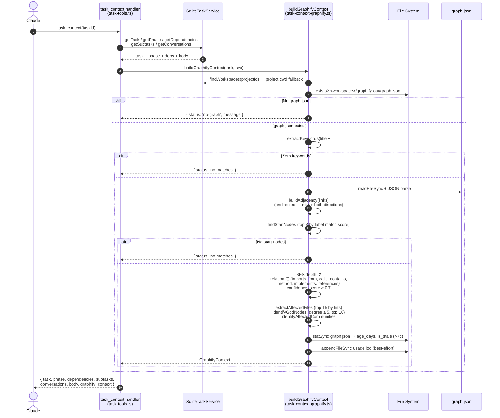

# ADR-016: Graphify Integration — Query-Only Phase 1, Manual Refresh

> **Status:** ✅ Accepted
> **Trigger:** TASK-607 Spike 2 — pick update strategy for `graphify-out/graph.json` before implementing `task_context` graphify injection.

---

## Context

TASK-607 extends `task_context(taskId)` MCP with a graphify-driven section (`affected_files`, `god_nodes`, `keywords_used`) so Claude doesn't Glob/Grep blind when planning. The query side is validated (Spike 1 — file-based BFS port matches Python baseline, 5-11 ms per query).

The open question Spike 2 addressed: **how does `graphify-out/graph.json` stay fresh without Butter manually remembering `/graphify --update`?** Four options were on the table: A) manual, B) post-commit hook (`graphify hook install`), C) `--watch` daemon, D) spawn from Electron on `session_end`.

### Findings from Spike 2 (`C:\temp\spike-output\update-strategy.md`)

1. **Timing is a non-issue.** The full code-only rebuild pipeline is ~1.3s warm / ~3s cold end-to-end via either trigger. Choice is not a performance call.

2. **Option B is broken on Windows out-of-box.**
   - `graphify hook install` shebang detection reads `head -1` of the `graphify` bin — but on Windows that's a PE-format `.exe` wrapper, not a Python script. Returns binary garbage, detection fails silently, falls back to `python3`.
   - `python3` on Windows is the Microsoft Store stub → prints an install prompt and exits 9009. Hook installs cleanly, runs on every commit, rebuilds nothing.

3. **The rebuild pipeline itself has a bug.** `graphify/watch.py:29` does `detected[FileType.CODE]` but `graphify.detect.detect()` returns `{'files': {'code': [...], ...}}`. `KeyError: <FileType.CODE: 'code'>` on every invocation. Affects both B and D since both call the same function.

4. **`_rebuild_code` is destructive even when fixed.** Manually bypassing the bug and running the equivalent pipeline on `C:\dev\choda-deck` dropped the graph from **818 → 558 nodes / 1158 → 825 edges**. The AST-only rebuild replaces `graph.json` wholesale and drops every node/edge that semantic extraction produced from docs, papers, and images (ADRs, vault notes, `DESIGN.md`). Queries that previously surfaced doc-layer context stop finding it.

5. **Option D works cleanly as a spawn pattern** — `child_process.spawn('python.exe', ['-c', …])` from Node gives us explicit interpreter path, ~3s wall time, fire-and-forget from Electron main. But it calls the same destructive pipeline, so shipping it now would regress graph quality immediately.

---

## Decision

**Phase the rollout. Ship Phase 1 with TASK-607; Phase 2 and Phase 3 are separate follow-up work.**

### Phase 1 — ship now, with TASK-607

- **Auto-refresh: none.** Do not install the git hook. Do not spawn from `session_end`.
- **Staleness surfacing in `task_context`.** When `graphify_context` is appended, include:
  - `graph_mtime_iso: string`
  - `graph_age_days: number`
  - `graph_is_stale: boolean` (true when age > 7 days, threshold configurable)
- **Missing-graph guidance.** If `graphify-out/graph.json` is absent, return the existing hint: `"no graphify context — run /graphify <path> to enable"`.
- **Refresh is manual.** README / setup note: "After significant code or doc changes, run `/graphify <path> --update` to refresh the graph."
- **Relation filter amendment** (from Spike 1 §5): the AC-spec `{CALLS, IMPLEMENTS, EXTENDS, USES}` collapses real queries to 1 file. Use `{imports_from, calls, contains, method, implements, references}` instead. `EXTENDS` and `USES` don't exist in the current graphify ontology.

### Phase 2 — follow-up task: auto-refresh on `session_end`

Wire Option D (fire-and-forget spawn from Electron main on `session_end`) **only after** at least one of these is true:

1. Upstream graphify fixes `_rebuild_code` (FileType key bug + Windows shebang).
2. Choda-deck ships a wrapped refresh helper (owned script bundled with choda-deck) that:
   - Uses explicit python path, avoids shebang detection.
   - Short-circuits if only doc/paper/image files changed in the session diff (skip rebuild to preserve semantic nodes; optionally write `needs_update` flag instead).
   - Merges code-layer rebuild into existing graph instead of replacing it.
   - Reports back to choda-deck as a structured session artifact.

Target: non-blocking `session_end`, ~3-5s background work, session artifact records refresh outcome.

### Phase 3 — upstream fixes

File upstream issues / PRs for:
- `graphify.watch._rebuild_code` `FileType.CODE` dict-key bug.
- `graphify.hooks._PYTHON_DETECT` Windows shebang assumption.
- `_rebuild_code` destructive semantics — default should merge, not replace.

If upstream is slow, maintain the local wrapper in Phase 2 indefinitely.

---

## Implementation Flow (Phase 1 — shipped)

Sequence of a single `task_context(taskId)` call after TASK-607 landed. Entry point: `src/adapters/mcp/mcp-tools/task-tools.ts:47`; graph logic: `src/adapters/mcp/mcp-tools/task-context-graphify.ts`.

### Invariants the flow enforces

- **File-based query, no DB.** Each call re-reads `graph.json` (5-11 ms cold per Spike 1). No cache — rebuild overwrites the file wholesale, so mtime is authoritative.
- **Staleness is a signal, not a gate.** `graph_age_days > 7` sets `graph_is_stale: true`; Claude decides whether to verify or run `/graphify update`. Phase 1 never auto-refreshes.
- **Graceful skip.** Missing graph or zero matches returns `{ status, message }` — `task_context` always succeeds.
- **Ontology amendment lives in code.** Spec's `{CALLS, IMPLEMENTS, EXTENDS, USES}` was replaced by `{imports_from, calls, contains, method, implements, references}` at `task-context-graphify.ts:53-60` (per Decision §Phase 1). `EXTENDS`/`USES` do not exist in the current graphify ontology.
- **Telemetry via usage.log.** Each successful query appends a TSV row (taskId, keywords_count, subgraph_size, affected_files, god_nodes, communities, graph_age_days). Write errors are swallowed (`task-context-graphify.ts:190-192`) — telemetry must never fail `task_context`.

---

## Rejected options

### Option B — `graphify hook install` (post-commit)

- Windows-broken out-of-box (silent no-op; fails before reaching the destructive pipeline).
- Even if fixed, destroys doc-layer nodes on every commit.
- Runs on commits unrelated to choda-deck work — fixup commits, rebases, unrelated branches all trigger rebuild.
- Blocks commit for ~3-4.5s sync wait.
- No structured reporting back to choda-deck.
- We'd end up building a choda-deck-owned hook installer to fix the Windows issue — at which point we've duplicated the work needed for Option D anyway, with worse ergonomics.

### Option C — `--watch` daemon

- Same coverage as Option D plus daemon lifecycle complexity (multiple workspaces = multiple watchers, OS resource usage, orphaned processes on crash).
- Unchanged from the original TASK-607 research section B.

### Option A — manual forever

- Accepted **for Phase 1 only** as a pragmatic ship point. Long-term, drift is a real risk (TASK-607 §Risks R1 called this out). Phase 2 addresses it; Phase 3 makes it safe.

---

## Consequences

**Positive:**
- Ships TASK-607 query path now without waiting on upstream bugs.
- Staleness signal (`graph_age_days`, `graph_is_stale`) means Claude can caveat "may be out of date" in planning output instead of silently acting on stale context.
- No regression to the existing 818-node semantic graph (once Butter rebuilds it — see Migration below).

**Negative:**
- Butter owns manual `/graphify --update` until Phase 2 lands. New follow-up task required.
- Phase 2 depends on either upstream fix or a choda-deck-owned wrapper — more engineering than just "install the hook".

**Migration:**
- Spike 2 clobbered `graphify-out/graph.json` during the destructive-rebuild test (818 → 558 nodes). Butter needs to re-run `/graphify C:\dev\choda-deck` via the slash command to restore the full semantic graph. This is a one-time LLM cost.
- Uninstall the hooks installed during the spike: `graphify hook uninstall` from the repo root.

---

## Open points (non-blocking)

1. Threshold for `graph_is_stale` — 7 days is a guess. Revisit after a few weeks of Phase 1 usage.
2. Should `task_context` also surface `affected_communities` (per Spike 1 §8)? Decision deferred — propose yes if it adds meaningful scoped-vs-cross-cutting signal; falls in TASK-607 implementation phase.
3. Confidence filter `≥ 0.7` is a no-op on the current graph (all edges ≥ 0.8). Keep as a safety net for future graph schemas or drop to simplify? Proposed: keep.

---

## Related

- TASK-607 — Inject graphify query result into `task_context`
- Spike 1 — `C:\temp\spike-output\bfs-validation.md`
- Spike 2 — `C:\temp\spike-output\update-strategy.md`
- Skill: `~/.claude/skills/graphify/SKILL.md`
- Python source (bugs referenced): `graphify/watch.py`, `graphify/hooks.py`
