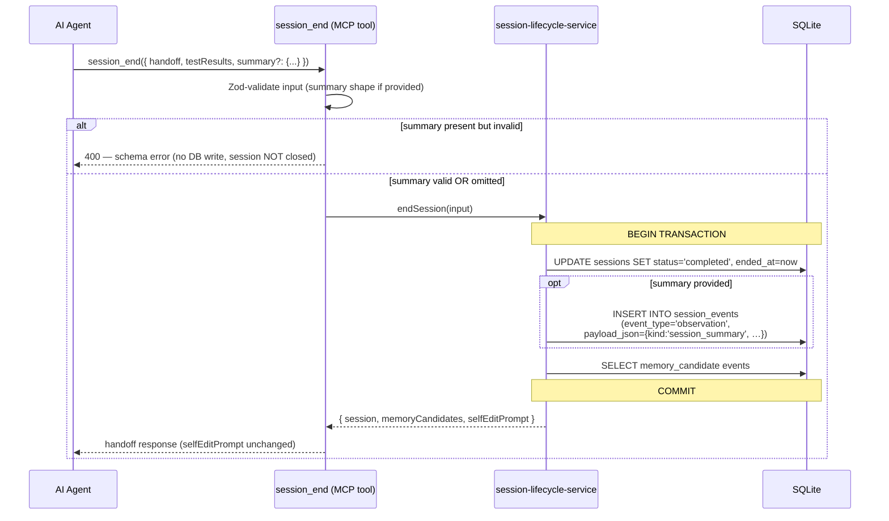
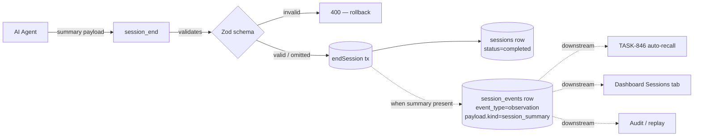

# ADR-028: Structured session-summary observation at session_end

> AI-Context: `session_end` accepts an optional typed `summary` field. When provided, the server writes one `eventType='observation'` row with `kind: 'session_summary'` payload-discriminator, Zod-validated, atomic with session close. `selfEditPrompt` / `memory_write` path unchanged. Solves **Quality** (shape drift between sessions), not **Coverage** (which stays AI-opt-in).

## Context

`session_event_add` real-world coverage is **2 of 190 sessions** (≈1%; see INBOX-372). Of the 6 events ever recorded, 4 were smoke tests; only 2 — both from Butter PIM workspace on 2026-05-20, ~41s apart — carried structured workflow data (`tasksDone`, `commits`, `filesChanged`, `acCoverage`, `openItems`, …).

The existing payload schema in [[session-event-add]] is `z.record(z.string(), z.unknown())` — anything serialisable goes — so "structured" today is a Butter convention, not enforced. Smoke events stuffed `"Smoke decision A"` into the same column; readers can't trust the shape.

Downstream consumers stalled by this:
- TASK-846 (Phase 3 auto-recall) — wants prior-session structure to inject into new sessions
- Dashboard "Sessions" tab — uses duration as a proxy because payload shape is unreliable
- Audit / replay — can't reconstruct decisions without a stable shape

Two distinct problems are tangled in INBOX-372:

| Problem | What it means |
|---|---|
| **Quality** | When events ARE logged, the shape varies per caller (Butter vs smoke vs nothing). |
| **Coverage** | Events almost never get logged at all (1% of sessions). |

This ADR addresses **Quality only**. Coverage stays AI-driven (an opt-in payload field on `session_end`); the dispatcher auto-log path is deferred until TASK-846 demonstrates real starvation.

## Options considered

| Option | Pro | Con |
|---|---|---|
| A. Extend `selfEditPrompt` text → ask AI to call `session_event_add` with schema | No schema change, prompt-only fix | Same AI-compliance failure as today; Butter format depends on AI memory |
| B. Typed optional `summary` input on `session_end`; server validates + persists | Schema is the contract; one well-shaped row per close; backward compat | One more opt-in field; doesn't move coverage past ~1% |
| C. New `eventType='session_summary'` enum value + typed payload | Cleaner separation, queryable by enum | Enum migration; PIM real examples use `'observation'`, would break parity |
| D. Auto-emit on `session_end`, server derives from handoff (no AI input) | 100% coverage of closed sessions | Handoff lacks acCoverage / openItems / commits attribution — would need substantial derivation logic with no obvious source |

## Decision

**Chosen: Option B** — typed optional `summary` field on `session_end` input, Zod-validated server-side, persisted as one `eventType='observation'` row with `kind: 'session_summary'` payload-discriminator.

### Why not C (new event type)

The 2 real PIM events used `eventType='observation'` with the rich payload — matching that pattern means existing readers ([[session-event-list]]) continue to work, and no enum migration is needed. The discriminator lives in JSON payload, where shape evolution is cheap.

### Why not D (server-derived)

The Butter gold-format includes fields the server can't reliably derive from handoff alone — `acCoverage` carries per-AC verify reasoning, `openItems` carries forward-looking judgment, `commits` attribution requires git context. Forcing the AI to provide them keeps quality high; server only enforces shape.

### Sequence



### Payload shape (Zod sketch)

```ts
const SessionSummarySchema = z.object({
  kind: z.literal('session_summary'),
  summary: z.string(),
  tasksDone: z.array(z.string()),
  tasksCreated: z.array(z.string()),
  tasksCancelled: z.array(z.string()),
  commits: z.array(z.string()),          // "<hash> <task-id>"
  filesChanged: z.array(z.string()),     // "<path> (<what changed>)"
  acCoverage: z.record(z.string(), z.string()),
  conversations: z.array(z.string()),
  openItems: z.array(z.string()),
  // BE optional extensions (EVT-1779256908201-3 shape)
  tasksShipped: z.array(z.object({
    id: z.string(), title: z.string(),
    commits: z.array(z.string()), files: z.array(z.string()),
    tests: z.number(), confidence: z.number()
  })).optional(),
  tasksNotDone: z.array(z.object({ id: z.string(), reason: z.string() })).optional(),
  testCoverageSummary: z.string().optional(),
  outstandingRisks: z.array(z.string()).optional(),
  branchState: z.string().optional()
})
```

FE base fields are required when `summary` is provided. BE extensions can be added piecewise — they reflect richer BE-session telemetry (EVT-1779256908201-3) and don't break the FE case.

### Data flow — where the row lands



## Consequences

**Positive**
- One canonical "what happened this session" row per closed session (when AI opts in)
- TASK-846 can recall via `json_extract(payload_json, '$.kind') = 'session_summary'`
- Dashboard gets reliable shape without parsing free-text handoff
- Schema rejects malformed payload before it pollutes the table — no more `"Smoke decision A"` rows
- No enum / schema-version migration needed; parity with existing PIM events

**Negative / not solved**
- Coverage still depends on AI compliance — opt-in field, can be skipped. Not regressed, not improved past today's baseline.
- Pre-existing `observation` rows without `kind` continue to coexist; readers MUST tolerate both shapes (treat missing `kind` as "untyped observation").
- One more shape for AI to learn — mitigated by anchoring the `onSessionEnd` MCP rule on EVT-1779256867162-5 as a canonical example (ADR-013 pattern).

**Defers**
- Coverage problem (INBOX-372 Option A — dispatcher-layer auto-log) — revisit only if TASK-846 ships and starves on "not enough events."

## Related
- INBOX-372 — coverage gap finding (root motivation)
- INBOX-373 — sister inbox proposing the schema (converted → TASK-904)
- TASK-904 — implementation of this ADR
- TASK-827 — Phase 2 self-edit (DONE, complementary `memory_write` path)
- TASK-846 — Phase 3 auto-recall (downstream consumer of `session_summary` events)
- [[ADR-009-session-lifecycle]] — session_end semantics
- [[ADR-013-session-rules-injection]] — `onSessionEnd` rule injection point
- [[ADR-023-agent-memory-layer]] — memory pipeline this feeds
