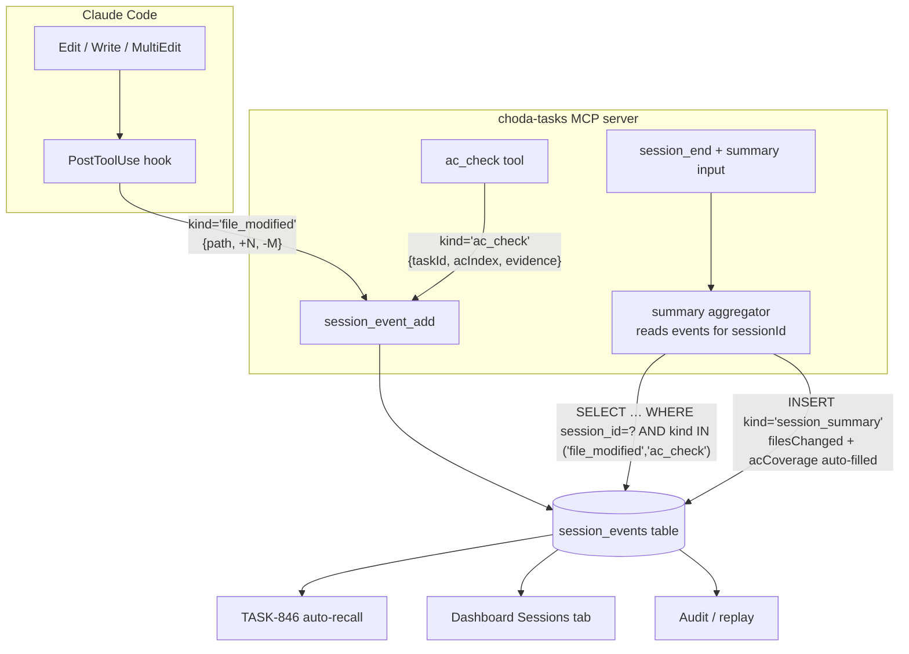
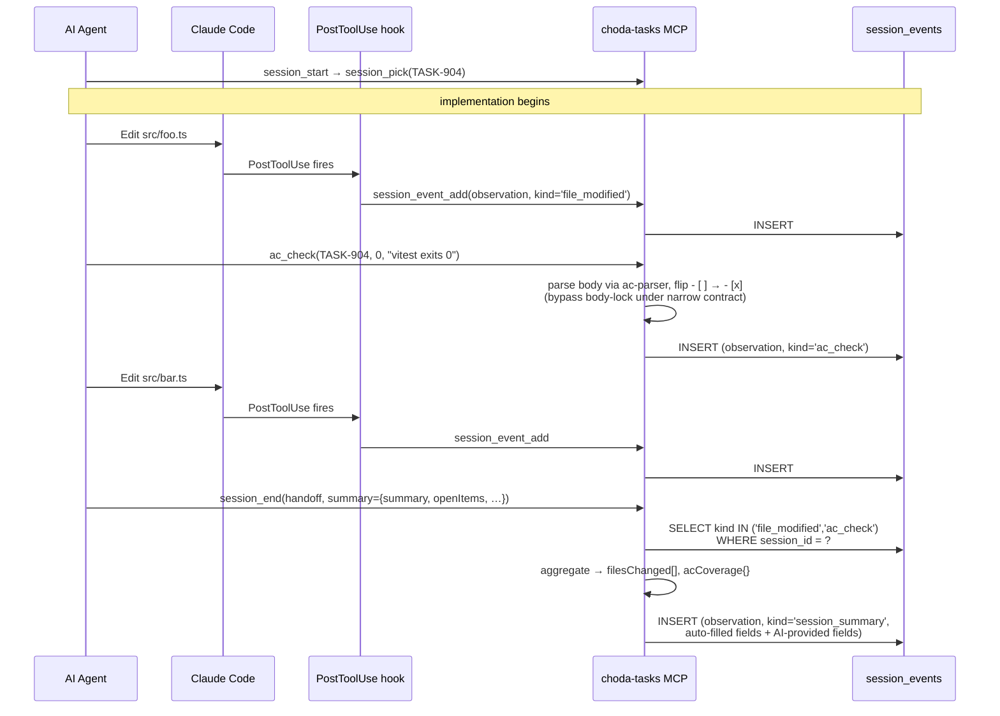

# ADR-029: Session activity visibility — file edits, AC verification, end-of-session summary

> AI-Context: Three coordinated channels make every session leave a navigable activity trail in `session_events`: (1) Claude Code `PostToolUse` hook captures file edits → `kind='file_modified'`; (2) new `ac_check` MCP tool flips `## Acceptance` items + emits `kind='ac_check'`, bypassing the body-lock (ADR-024) under a narrow contract; (3) `session_end` summary (ADR-028 / TASK-904) **auto-aggregates** `filesChanged` + `acCoverage` from the events above. Solves both **Quality** and **Coverage** from INBOX-372.

## Context

INBOX-372 surfaced 1% real coverage on `session_event_add` (2 of 190 sessions). ADR-028 / TASK-904 added a typed `summary` field on `session_end` to fix **Quality** (shape drift between callers). It does NOT fix **Coverage** — the summary field is opt-in and only fires once per close.

Operator need (this conversation, 2026-05-21): *"I want to trace each file modified and each AC completed during task implementation."* That's continuous, per-action visibility — not just end-of-session.

Two structural obstacles to closing the gap:

| Obstacle | Why it exists |
|---|---|
| **MCP can't see `Edit`/`Write`** | Those are Claude Code built-in tools, not MCP tools. The `InstrumentedServer` wrapper at `src/adapters/mcp/instrumented-server.ts:37-62` intercepts every MCP call, but file edits live outside that boundary. |
| **AC items can't be ticked mid-implementation** | AC lives in `## Acceptance` body checklist (parsed by `ac-parser.ts`), but `task_update` locks `body` while status ∈ {IN-PROGRESS, DONE, CANCELLED} per ADR-024 (spec-drift prevention). No API path to flip `- [ ]` → `- [x]` while the task is active. |

Both gaps must be closed for real-time visibility. Both events should land in the same `session_events` table the end-of-session summary already uses — so downstream consumers (TASK-846 auto-recall, Dashboard Sessions tab, audit/replay) read one source.

## Options considered

| Option | Pro | Con |
|---|---|---|
| A. Status quo + handoff JSON | Zero work | 1% coverage; reviewer / TASK-846 has no per-action trace |
| B. Dispatcher-layer auto-log on all MCP state-changers (INBOX-372 Option A) | Catches `task_update`, `inbox_*`, `knowledge_*` automatically | **Misses Edit/Write entirely** (outside MCP boundary); doesn't solve AC verification gap; generic `tool_call` rows are noisy |
| C. Three coordinated channels (this ADR) | Targets exactly the two signals the operator asked for; reuses `session_events`; backward-compatible; aggregator auto-fills summary | Three pieces of work (hook + new MCP tool + summary aggregator); hook requires per-machine CC config |
| D. Git-diff polling + body-diff polling | No hook setup; works on any developer machine | Not real-time (poll cadence ≥ minutes); body-diff still hits the body-lock; can't attribute edits to a specific decision moment |

## Decision

**Chosen: Option C** — three coordinated channels feeding `session_events`, with `session_end` summary auto-aggregating from them.

### Channel map

| # | Signal | Source | Mechanism | Event row |
|---|---|---|---|---|
| 1 | File modified | Claude Code | `PostToolUse` hook on `Edit\|Write\|MultiEdit` → calls `session_event_add` | `event_type='observation'`, `payload.kind='file_modified'`, `{path, linesAdded, linesRemoved}` |
| 2 | AC verified | AI agent | New MCP tool `ac_check(taskId, acIndex, evidence)` — flips checkbox, bypasses body-lock under narrow contract | `event_type='observation'`, `payload.kind='ac_check'`, `{taskId, acIndex, text, evidence}` |
| 3 | End-of-session summary | AI agent | `session_end` with `summary` input (ADR-028) — `filesChanged` + `acCoverage` **auto-derived** from #1 and #2 rows for this session | `event_type='observation'`, `payload.kind='session_summary'`, `{summary, tasksDone, filesChanged*, acCoverage*, …}`<br/>(*) auto-aggregated |

### System overview



### Sequence — typical task implementation



### Body-lock exception (narrow contract)

ADR-024 locks `body` and `title` when status ∈ {IN-PROGRESS, DONE, CANCELLED}. `ac_check` is the **only** sanctioned bypass, under these constraints:

- May only flip a single AC checkbox character: `- [ ]` → `- [x]` at the position identified by `acIndex`
- May NOT edit AC text, change ordering, add/remove items, or touch any other body content
- Server validates: parse body with `ac-parser`, compute target position, assert before-text ends with `- [ ]`, write after-text ending with `- [x]`; any other diff → reject with `BODY_LOCK_VIOLATION`
- Emits the `ac_check` event in the same SQLite transaction as the body update

This preserves spec-drift prevention while enabling per-AC verification telemetry.

### Hook contract (per-developer setup)

```jsonc
// ~/.claude/settings.json
{
  "hooks": {
    "PostToolUse": [
      {
        "matcher": "Edit|Write|MultiEdit",
        "hooks": [
          {
            "type": "command",
            "command": "node C:\\dev\\choda-deck\\scripts\\hooks\\file-edit-event.mjs"
          }
        ]
      }
    ]
  }
}
```

The hook script:
1. Reads `$CLAUDE_TOOL_INPUT` (CC injects the tool payload as JSON env var)
2. Resolves active session by `cwd` → workspace → `getActiveSession(workspaceId)` (one active session per workspace by ADR-009)
3. Calls `session_event_add` via stdio MCP, or directly via the same `better-sqlite3` connection (TBD at implementation)
4. Swallows all errors — never crashes the host `Edit`

Hook is **opt-in per developer**. Without it, channels 2 and 3 still work — sessions just lose the file-edit telemetry.

### Summary aggregator behavior (TASK-904 extension)

When `session_end` runs with `summary` input:

```
for each file_modified event in this session:
  if path not already in summary.filesChanged from AI input:
    append "path (+linesAdded, -linesRemoved)"

for each ac_check event in this session:
  group by taskId
  count checked vs total AC items for that task (via ac-parser snapshot)
  emit "TASK-X: N/M verified (evidence summary)" into summary.acCoverage[taskId]
  if AI already provided acCoverage[taskId], prefer AI text but append "+ K auto-detected"
```

AI input wins on conflict — agent's judgment narrative trumps mechanical aggregation. Aggregator only fills gaps.

## Consequences

**Positive**
- Per-session navigable timeline: every file edit + every AC tick + final summary all in `session_events`, one table
- AI no longer has to retype `filesChanged` / `acCoverage` in the end-of-session summary — server aggregates
- TASK-846 (Phase 3 auto-recall) gains rich, structured recall material per past session
- Dashboard Sessions tab renders real activity timelines (replaces duration-as-proxy from INBOX-372)
- Body-lock invariant preserved — `ac_check` is the only exception, with server-validated contract

**Negative / accepted tradeoffs**
- Hook is per-machine config; developers without it get channels 2+3 only (degraded but functional)
- `ac_check` adds a new MCP tool surface — narrow purpose, but maintenance burden
- Aggregator couples the summary writer to the event reader — event schema changes require coordinated updates

**Defers**
- Dispatcher-layer auto-log for MCP state-changers (INBOX-372 Option A; `task_update` / `inbox_convert` / `knowledge_create`) — revisit if channels 1+2 leave TASK-846 starved
- Cross-platform hook script (Mac/Linux) — Windows ships first
- Demoting `kind` from JSON payload to a real column on `session_events` (queryable index) — defer until query patterns prove the need

## Implementation roadmap

| Order | Work | Status |
|---|---|---|
| 1 | Channel 3 — typed `summary` on `session_end` + observation row | **TASK-904** (READY) — ADR-028 |
| 2 | Channel 2 — `ac_check` MCP tool + body-lock narrow exception | **NEW** (to spec) |
| 3 | Channel 1 — `PostToolUse` hook script + session resolution | **NEW** (to spec) |
| 4 | Aggregator — `session_end` reads channels 1+2 to auto-fill summary | follow-up to TASK-904 once channels 1+2 land |

Order matters: channel 3 ships standalone (AI provides full summary). Channels 1+2 then add real-time telemetry. Aggregator (step 4) is the payoff that makes the summary mostly write itself.

## Related

- [[ADR-028-session-end-structured-summary]] — channel 3 (depends on this ADR for the aggregator behavior)
- [[ADR-024-review-status-and-session-checkpoint]] — body-lock that `ac_check` narrowly exempts
- [[ADR-013-session-rules-injection]] — where the `onSessionEnd` rule documents the schema
- [[ADR-023-agent-memory-layer]] — downstream consumer of these events
- [[ADR-009-session-lifecycle]] — workspace ↔ active-session resolution used by the hook
- INBOX-372 — coverage gap finding (Quality solved by ADR-028, Coverage solved by this ADR)
- INBOX-373 — sister inbox (schema; converted → TASK-904)
- TASK-846 — Phase 3 auto-recall (consumer)
