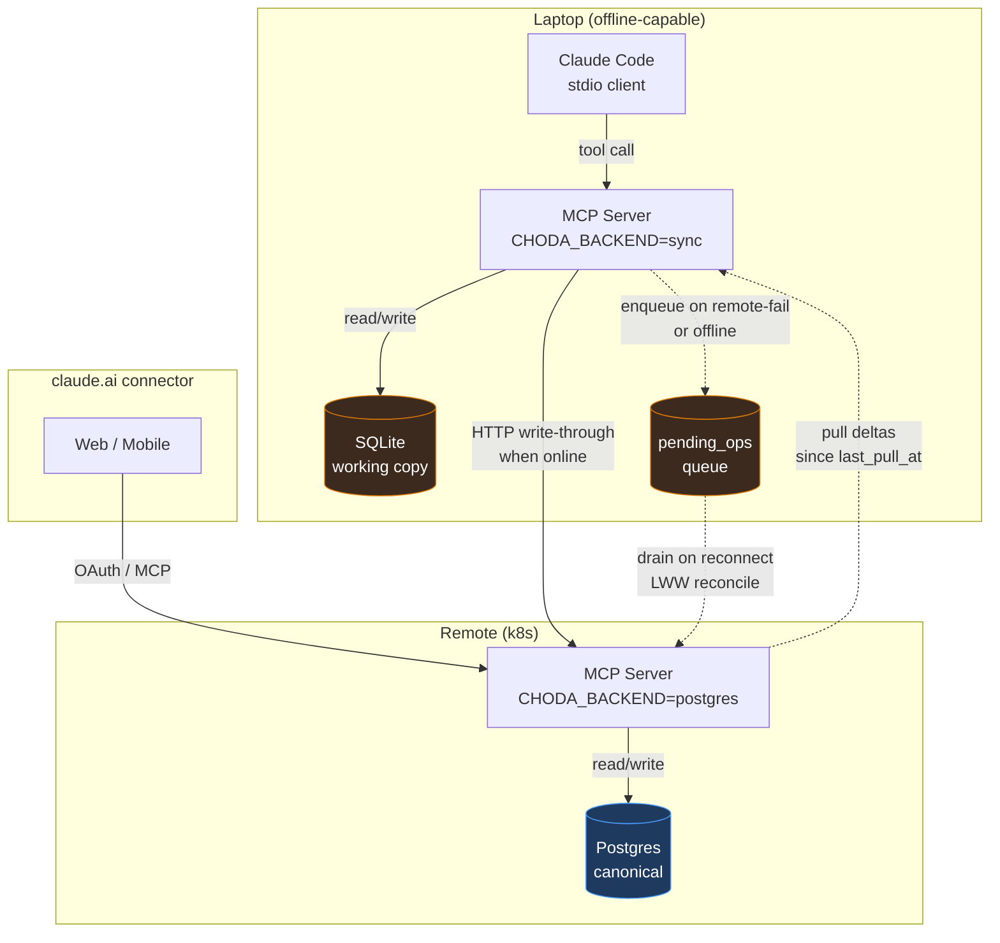

> **AI-Context:** Two storage backends behind one driver port. Local MCP (stdio) drives SQLite; remote MCP (http, k8s) drives Postgres. The laptop syncs to remote via a **pending-ops queue + LWW reconciliation** built on top of the existing `src/core/sync/` snapshot machinery. Remote Postgres is **canonical when reachable**; local SQLite is a working copy that can write offline and drain on reconnect. Op-log-per-tool-call is rejected — the existing export/import + a small pending queue covers single-user multi-device without it.

## Update 2026-05-28 — adapter narrowed to remote-allowlist call graph

The full 16-repository `PostgresTaskService` shipped in TASK-934 was over-built for the actual deployment: HTTP transport exposes only 6 tools via `REMOTE_TOOL_ALLOWLIST` (see [[ADR-026-dual-transport-mcp-server]] §Per-tool scoping) and Butter is solo — multi-replica scale was never load-driven. The unreachable repos (sessions, conversation writes, knowledge, memory, embeddings, session events, agent memories, tool invocations, documents) have been deleted, along with their migrations, tests, and the `pgvector` extension dependency.

PG now implements only `RemoteOperations` (`src/core/domain/remote-operations.interface.ts`) — 15 service methods + 2 lifecycle hooks, strict subset of `BackendTaskService`. The split is enforced two ways:
- `requireBackendForTransport(backend, transport)` in [[task-service-factory.ts]] rejects `CHODA_BACKEND=postgres` + `MCP_TRANSPORT=stdio` at boot (the stdio surface would call deleted methods on the first tool invocation).
- The standing rule in [[ADR-026-dual-transport-mcp-server]] §Per-tool scoping: when the allowlist grows, `RemoteOperations` and the PG facade grow in lockstep — same PR, no preemptive build-out.

Code reduction: `postgres-task-service.ts` 1208 → ~150 lines; 8 `.pg.ts` repo files + the pgvector store deleted; 11 `.pg.test.ts` files deleted; migrations 11 → 6 entries.

The **sync engine** (open in §Status table below) is unaffected by this narrowing — it remains future work, gated on a real concurrent-write incident or a daily-driver claude.ai connector. If/when sync lands, the methods needed for drain/reconcile would expand `RemoteOperations` (or graduate to a different port). _(Superseded by the 2026-06-11 update below — Phase 3-6 shipped for tasks + inbox.)_

## Update 2026-06-11 — Phase 3-6 shipped (tasks + inbox); endpoint, not tool surface

Write-through landed for **tasks + inbox** (TASK-979, sub-tasks 1063–1066, PR #183). Two design points diverged from the original plan above:

- **Dedicated endpoint, not the MCP tool surface.** The §How-it-works drain says "POST to the remote MCP tool". It doesn't: the write path is `POST /sync/apply` on the HTTP transport, symmetric to the shipped `GET /sync/since` read path, auth-gated identically. This keeps `REMOTE_TOOL_ALLOWLIST` unchanged (still the 6 read+capture tools — claude.ai's surface stays read-only) and puts server-side LWW in one place (`applyDeltaToPg`). The narrowing above is therefore *not* reversed for tasks/inbox — `RemoteOperations` grew by `applyDelta` only, no task-mutation tools were added.
- **`conversation_messages` deliberately excluded.** Plain LWW there could silently drop a load-bearing `decisionSummary` — the exact risk that parked this engine. Conversation sync needs an append-preserving merge and is tracked separately as the gated **TASK-1067 (979e)**, to be designed against a real observed conflict, not in the abstract.

Stamping lives entirely in the write-through wrapper (`sync-write-through.ts`), so a plain stdio server with sync off is unchanged. `pending_ops` + `sync_conflicts` are local-SQLite-only tables; a dropped op is recorded **and** surfaced as a raw `inbox_add`.

## Update 2026-06-18 — token-refresh for continuous sync against the OAuth remote (Option A) (TASK-1108)

`CHODA_BACKEND=sync` runs a background drain/pull loop that authenticates to the OAuth-mode remote (`mcp.choda.dev`, [[ADR-034-keycloak-backed-http-auth-via-on-origin-proxy]]) with a bearer JWT. Keycloak access tokens are short-lived and `http-write-client.ts` / `http-pull-source.ts` send whatever bearer they were handed at boot — so continuous two-way sync died ~5 min after start when the token expired. Only one-shot `pull`/`status` (inside the token window) worked; the `/choda-sync` skill refused to start continuous mode for this reason. This is the gate for the always-on Design↔Code channel (TASK-1130).

**Decision: Option A — client-side refresh-token flow** (over B = long-lived service token, C = one-shot-only).

- **C rejected** — it abandons continuous sync, killing the channel's purpose.
- **B rejected** — a static service credential on the laptop is higher blast-radius and collapses audit identity to one principal, which undercuts the `sync_origin`-tagged conflict model. A keeps per-user Keycloak identity, and a rotating refresh token is revocable + shorter-lived than a static service secret.

**Verified live against `id.choda.dev/realms/demo`, client `claude-connector` (2026-06-18):** the ROPC password grant returns a `refresh_token` with **no `offline_access` scope needed**; the `refresh_token` grant round-trips and **rotates** (new refresh token each call). Token windows: **access `expires_in=300s`, refresh `refresh_expires_in=1800s` (30 min idle)**.

Design consequences for the implementation slice (AC-2/AC-4):
- The drain loop refreshes the access token **before `exp`** (e.g. ~30s margin); refreshing more often than every 30 min keeps the rotating refresh token alive indefinitely up to Keycloak SSO max-session.
- The refresh token only survives **30 min idle** — so after a laptop **sleep > 30 min** it is dead. The durable credential is therefore the **ROPC username/password** (`sensitive_information/keycloak-demo-user.txt`), used to re-mint from cold; the refresh token is the warm-path optimization, not the source of truth.
- Store the live refresh token only in memory (or gitignored `sensitive_information/`); never commit it. Touch points: `http-write-client.ts`, `http-pull-source.ts`, the drain-loop boot path, and the `/choda-sync` skill guard (which flips from "refuse continuous" to "start the loop").

Implementation + the `/choda-sync` guard flip land under TASK-1108's AC-2/AC-4; conversation sync rides on top via TASK-1067.

## Status (2026-06-11)

| Component | State | Where it landed |
|---|---|---|
| Backend service port (`BackendTaskService`) | **Done** | TASK-933 + TASK-934 slice 11 (facade) |
| Postgres adapter (`PostgresTaskService`) — all 24 service methods | **Done** | TASK-934 slices 1–20b (PRs #131–#152) |
| pgvector embedding store + slug-keyed `EmbeddingStorePort` | **Done** | TASK-934 slice 14 + 20b |
| Factory wiring via `CHODA_BACKEND` env | **Done** | TASK-934 slice 11 |
| One-shot SQLite → Postgres data migration script | **Done** | TASK-934 slice 21 (`scripts/migrate-sqlite-to-postgres.mjs`) |
| docker-compose + README k8s recipe | **Done** | TASK-934 slice 21 |
| **Sync engine Phase 1+2 — additive `sync_*` columns + Lamport clock + read-only pull (`GET /sync/since`, `choda-deck sync pull`)** | **Done** | TASK-978 (PRs #178 schema, #179 pull) |
| **Sync engine Phase 3-6 (tasks + inbox) — `POST /sync/apply` + write-through, `pending_ops` queue, LWW drain, `sync_conflicts` + inbox surfacing, `CHODA_BACKEND=sync` mode** | **Done** | TASK-979 / 1063–1066 (PR #183) |
| Sync engine — `conversation_messages` write-through (append-preserving merge) | **Open** | gated (TASK-1067 / 979e) |

Phase 1+2 shipped (TASK-978): both backends carry namespaced `sync_updated_at`/`sync_deleted_at`/`sync_origin` columns; the remote `inbox_add` stamps a server-side Lamport tick; the laptop drains remote → local SQLite read-only via `GET /sync/since` + `choda-deck sync pull` with per-row LWW + tombstone propagation.

Phase 3-6 shipped for **tasks + inbox** (TASK-979 / 1063–1066, PR #183): `CHODA_BACKEND=sync` makes the laptop a write-through client — each mutating `task_*`/`inbox_*` call writes local SQLite, stamps the row (Lamport tick + `origin='laptop'`), and POSTs it to `POST /sync/apply`, which applies server-side LWW (canonical wins ties) and returns per-row verdicts. On a remote failure the op queues to `pending_ops` and the call still succeeds; a background loop drains (connectivity-gated via `/healthz`) then pulls. Dropped ops go to `sync_conflicts` + a raw `inbox_add`. `conversation_messages` is excluded (gated, TASK-1067). The ULID PK swap from §Schema additions remains deferred (rewrites every FK target — separate slice).

Remaining revisit trigger applies only to `conversation_messages` (TASK-1067): build the append-preserving merge when a real `decisionSummary` divergence with non-trivial cost is observed — not speculatively.

## Context

- Today both transports ([[ADR-026-dual-transport-mcp-server]]) hit the same `better-sqlite3` file. Multi-replica was explicitly deferred to [[INBOX-366]].
- `src/core/sync/` already implements snapshot export → git → snapshot import for **SQLite↔SQLite cross-device** ([[cross-device-sync-export-import-spec]], 2026-05-07). Canonical JSON shape, atomic apply, tombstones, manifest versioning — all already in code.
- Goal: extend the data layer so the **remote MCP HTTP server** writes to Postgres, while local MCP keeps SQLite — without rewriting the existing sync.
- Use case is single-user multi-device (laptop + claude.ai connector + future phone). Not multi-tenant. Not many writers. Conflict surface is rare-but-real (laptop edits offline, claude.ai connector edits same task remotely).

Research surveyed in [[CONV-1779449079722-1]]: ElectricSQL (rough 2026 edges), PowerSync (forces JSON-shape schema + sidecar service), Turso Sync (libSQL-only, no Postgres), Litestream (one-way DR, not bidirectional). None fit the "single-user multi-device + Postgres-required" shape better than building above the existing sync code.

## Decision

Two coupled changes:

**1. Backend abstraction (driver port).** Introduce `DatabaseDriver` async interface. Implementations: `SqliteDriver` (wraps `better-sqlite3` in `Promise.resolve`), `PostgresDriver` (uses `pg`). All services (`task-service`, `inbox-service`, `session-service`, …) move behind the port. `sqlite-task-service.ts` becomes `task-service.ts` (driver-agnostic).

**2. Sync mechanism (pending-ops + LWW).** Local SQLite gains a `pending_ops` table — append-only mutations queued when remote is unreachable. On reconnect, drain to remote with row-level LWW on `updated_at` (Lamport-logical, not wall-clock). Pull deltas back via the existing canonical-JSON snapshot pipeline, parameterized to accept Postgres as a source.

### Backend resolution

| Env | Backend | Sync |
|---|---|---|
| `CHODA_BACKEND=sqlite` (default for stdio) | SQLite | off |
| `CHODA_BACKEND=postgres` (default for http) | Postgres | off |
| `CHODA_BACKEND=sync` | SQLite + pending-ops queue | on — drains to remote MCP |

Auto-default tied to `MCP_TRANSPORT` (stdio→sqlite, http→postgres); explicit `CHODA_BACKEND` always wins. `PG_DSN` required when backend resolves to `postgres`.

### Schema additions (every syncable table)

- `id TEXT` — ULID (sortable UUID). Replaces INTEGER autoincrement. Migration: assign ULIDs, keep old PK as `legacy_id` (retained indefinitely for diagnostic + foreign-key bridging).
- `updated_at INTEGER` — Lamport-logical timestamp (monotonic counter persisted in `_sync_clock`), NOT wall-clock.
- `deleted_at INTEGER NULL` — tombstone, retention window 30 days (configurable via `CHODA_TOMBSTONE_TTL_DAYS`).
- `origin TEXT` — device that wrote this row (`laptop`, `remote`). Diagnostic only; not used in conflict resolution beyond tie-break.

### `pending_ops` (local SQLite only)

```sql
CREATE TABLE pending_ops (
  seq INTEGER PRIMARY KEY,
  table_name TEXT NOT NULL,
  row_id TEXT NOT NULL,
  op TEXT NOT NULL,         -- 'upsert' | 'delete'
  payload TEXT NOT NULL,    -- canonical-JSON row
  lamport INTEGER NOT NULL,
  enqueued_at INTEGER NOT NULL
);
CREATE INDEX idx_pending_ops_seq ON pending_ops(seq);
```

### Conflict rule

LWW per row on `(updated_at, origin)` — higher Lamport wins; tie-break by `origin` lexicographic (`laptop` < `remote`). Same-field concurrent edit on a tasks DB used by one human is rare enough that LWW is fine; full CRDT rejected per research conversation.

Conflicts that drop a queued op are logged to a local `sync_conflicts` table AND emitted as `inbox_add` items (raw status) so Butter sees them in the next `/daily`. Silent data loss is unacceptable; visible loss is.

### Write semantics

**Synchronous write-through on the tool call** — when laptop is online (`CHODA_BACKEND=sync`), every mutating tool call writes to local SQLite *and* the remote MCP, both completing before returning to Claude. Failure modes:

- Local write fails → tool call fails. Standard error path.
- Local write succeeds, remote fails (timeout / 5xx / network) → op enqueued to `pending_ops`, tool call returns success. The remote write becomes the queue's responsibility.

Rationale: consistency > latency. Async fire-and-forget would let Claude see "success" then have the write silently dropped if the queue drain later finds a conflict. Sync-then-enqueue keeps the success contract honest.

## How it works



**Lifecycle of a write — laptop (`CHODA_BACKEND=sync`):**

1. Claude Code calls e.g. `task_update`.
2. Service writes to local SQLite — sub-millisecond. Increments Lamport clock.
3. Service writes to remote MCP over HTTP (using OAuth from [[ADR-027]] or bearer from ADR-026).
   - **Success** → mark row `last_synced_at = now`. Return to Claude.
   - **Failure** (network / 5xx / timeout < 2s) → append op to `pending_ops`. Return to Claude. No error surfaced.

**Lifecycle of a write — remote (`CHODA_BACKEND=postgres`):**

1. claude.ai connector calls e.g. `task_update` via OAuth-gated HTTP.
2. Service increments Lamport clock + writes to Postgres in one transaction. Done.
3. No queue, no sync — Postgres is canonical.

**Reconnect drain — laptop (periodic + on-startup):**

1. Connectivity check (HEAD `/healthz`). Skip cycle if down.
2. For each row in `pending_ops` ordered by `seq`:
   - POST to remote MCP tool with the queued payload + `lamport`.
   - Remote applies LWW: if remote's `updated_at > op.lamport` → remote wins, op dropped, conflict logged to `sync_conflicts` + an `inbox_add` raw item.
   - Op succeeds → delete from `pending_ops`.
3. After drain, **pull** deltas: GET remote snapshot since `last_pull_at`, upsert into SQLite with LWW.

**Pull — laptop:**

1. Request: `since = last_pull_at`.
2. Remote returns all rows where `updated_at > since` OR `deleted_at > since`, in canonical-JSON shape (existing format from `canonical-json.ts`).
3. For each: if `local.updated_at >= remote.updated_at` → keep local. Else upsert (or apply tombstone).
4. Bump `last_pull_at` to max remote timestamp seen.

### Why pending-ops beats a full op-log

The existing `src/core/sync/` already speaks **snapshot of canonical-JSON rows**, not events. Adding `pending_ops` is ~150 lines on top; building a full event-sourced op-log replayer is ~2000 lines and re-implements what snapshot already does. Lamport timestamps + tombstones give LWW correctness without modeling every tool call as an event. Op-log is the right answer in isolation; in the context of the existing code, snapshot+queue wins.

## Options considered

| Option | Pro | Con |
|---|---|---|
| A. Status quo (single SQLite, both transports) | Zero change | Postgres-shaped problems (concurrency, scale) unresolved |
| B. Both transports → Postgres | Single backend, no sync needed | Loses offline-local, loses zero-config dev, k8s dep for `pnpm dev` |
| C. PowerSync as the sync engine | Battle-tested, ~1 week to wire | Forces JSON-shape schema (single-table + views), adds a sidecar service, single-user multi-device pays the multi-tenant tax |
| D. **Driver port + pending-ops + reuse existing snapshot** | Builds on shipped sync code, no new deps beyond `pg`+`ulid`, LWW correctness, MIT in-process | We own conflict logic forever; sync→async refactor touches every service |
| E. Full op-log / event sourcing | Audit log free, pure correctness | Re-implements snapshot infrastructure we already have; 4-6 weeks |
| F. Turso Sync (libSQL ↔ libSQL) | Single-binary sync | Postgres not supported → moves the goal posts |
| G. ElectricSQL | Active-active, MIT | 2026 production evaluators hit rough edges around shapes + reconnection |

## Why not others

- **C (PowerSync)**: schema rewrite + sidecar service is real cost; single-user use case doesn't earn back the multi-tenant features. Reconsider if a second human user ever joins.
- **E (op-log)**: rejected after finding `src/core/sync/` already exists. Op-log would supersede working code — wrong direction.
- **F (Turso)**: incompatible with the "remote = Postgres" requirement.
- **G (ElectricSQL)**: rough edges reported by production teams in early 2026; depending on shape-management bugs is the wrong bet for a personal-deploy use case where we don't have the bandwidth to chase upstream fixes.

## Consequences

- **Good:** Local stays zero-config (SQLite). Remote gets concurrency story (Postgres). Existing sync code is leveraged, not rewritten. Pending-ops queue is invisible to Claude — no error UX when offline. No new external service to deploy alongside the MCP HTTP server. Conflicts that LWW would silently drop become visible as inbox items.
- **Bad:** Service layer goes sync→async (every call site touched). Schema migration to ULIDs is non-trivial. We own LWW conflict logic; subtle bugs possible. Test matrix doubles — every service needs SQLite + Postgres coverage.
- **Risks:**
  - **Same-task concurrent edit** (laptop offline + claude.ai connector online) → LWW silently overwrites the loser. Mitigation: `sync_conflicts` table + `inbox_add` surfacing.
  - **Tombstone retention** — too short loses delete propagation, too long bloats the table. Default 30 days, configurable.
  - **Postgres pod restart drops in-flight drain** — drain is idempotent (Lamport guard), retry-safe.
  - **Schema drift between SQLite and Postgres** — two SQL files maintained in parallel. Mitigation: schema-parity test that introspects both at startup and fails CI on drift.
  - **Clock skew under partition** — Lamport clocks are causally consistent on a single device but two offline devices editing the same row can produce ties. Tie-break by `origin` is deterministic but arbitrary; that's the surfaced-conflict case.

## Impact

- **Files/modules to change:**
  - NEW: `src/core/data/database-driver.ts` (port), `sqlite-driver.ts`, `postgres-driver.ts`
  - NEW: `src/core/sync/pending-ops.ts`, `sync-reconcile.ts`, `lamport-clock.ts`
  - NEW: `src/core/sync/sync_conflicts` table + inbox emission hook
  - Refactor: all `*-service.ts` files behind driver port (sync → async). **Scoped as a prerequisite task** — land the refactor with no behavior change before any Postgres or sync code.
  - Extend: `src/core/sync/export-service.ts`, `import-service.ts` to accept either driver
  - Migration: assign ULIDs + add `updated_at`/`deleted_at`/`origin` columns. Idempotent script runnable on both backends.
  - `src/core/paths.ts`: backend-aware (Postgres has no `database/` file path; `PG_DSN` resolved instead).
  - `src/core/backup-service.ts`: branch on driver — file copy vs `pg_dump`.
  - `CLAUDE.md`: env var table addition (`CHODA_BACKEND`, `PG_DSN`, `CHODA_TOMBSTONE_TTL_DAYS`).
- **Dependencies added:** `pg` (~600 KB), `ulid` (~5 KB). No ORM in v1 — raw SQL kept for both backends.
- **Migration needed:** Yes. One-shot script: mint ULIDs, backfill `updated_at` from existing `created_at`/`updated_at` where available else `now()`, add columns, populate `origin='laptop'` for existing rows. Runs idempotently. Postgres schema bootstrapped from same migration source.

## Revisit when

- Second human user joins → conflict surface grows, may need CRDT for shared-edit tables (probably `conversation_messages` first).
- `pending_ops` regularly >10k entries → batch drain + payload compression.
- Postgres adoption stable + laptop offline use rare → consider deprecating the SQLite remote-write path entirely (laptop always proxies, no local persistence).
- `pg_dump` backup pain → switch to managed Postgres snapshot.
- LWW silently loses an edit Butter actually wanted despite the inbox surfacing → add per-field merge for `conversation_messages` (append-only CRDT-lite).
- Schema drift bugs recur → adopt Drizzle/Kysely for a single schema source of truth.

## Related

- Builds on: [[ADR-026-dual-transport-mcp-server]] — this ADR fills the deferred Postgres slot
- Builds on: [[cross-device-sync-export-import-spec]] — existing snapshot/canonical-JSON code is the foundation
- Supersedes: [[INBOX-366]] — subsumed into this ADR's Postgres scope
- Closes: [[INBOX-375]] — this research item
- Touches: [[ADR-012-sqlite-backup-restore]] — needs `pg_dump` branch
- Touches: [[ADR-027-oauth-mcp-server]] — write-through uses same auth path
- Researched in: [[CONV-1779449079722-1]]
