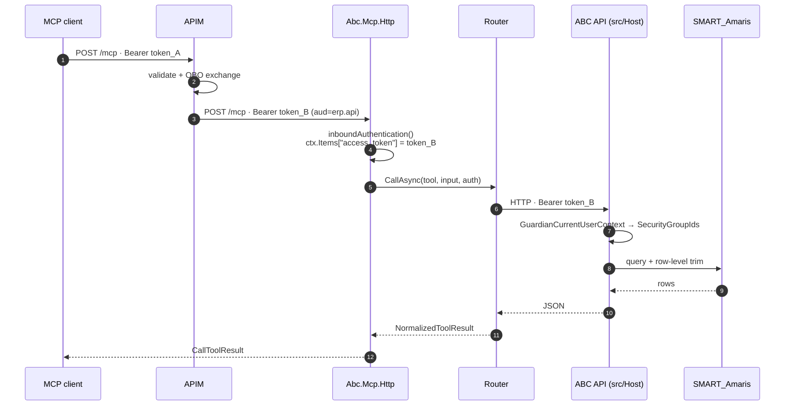
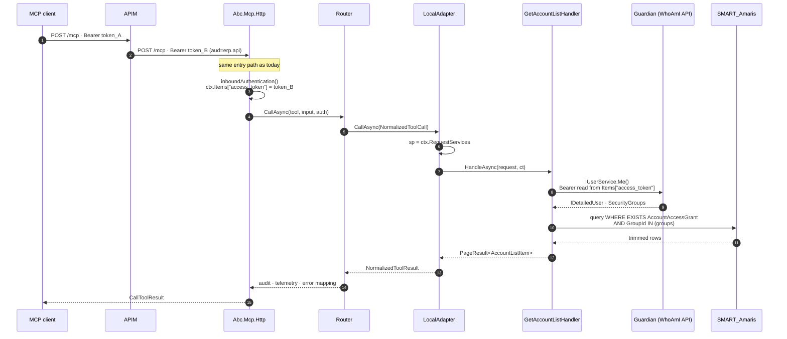
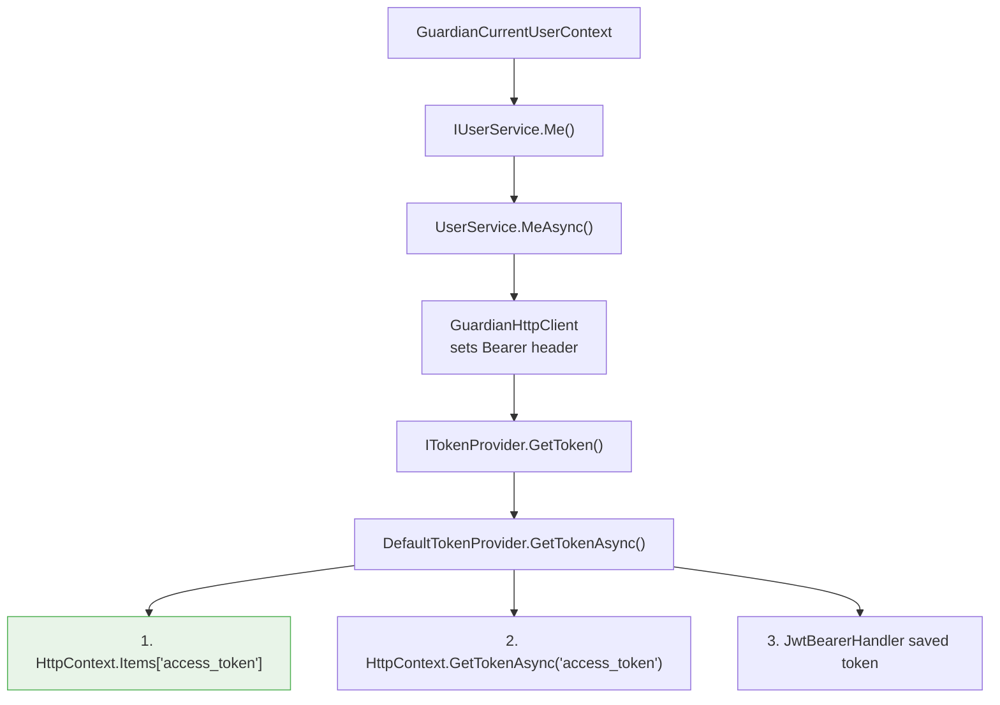

> Implementation status: **PROPOSED, implemented on a branch pending review** (2026-09-10).
> The decision itself is not yet ratified. TASK-1925/1926/1927 implement it as three commits on
> `feat/pure-mcp-module-adapter`; §7.5 stays open and blocks pure *write* tools only.
>
> The findings in §7 were verified statically (decompilation of the Guardian and MCP SDK
> assemblies). **Not yet observed on a deployed environment**, and the row-level-trim proof in §6
> is a `[DatabaseFact]` that SKIPS wherever SMART_Amaris is unreachable — so it has not run
> locally. Both remain outstanding before this can be called DECIDED.

---

## 1 — Context

`Abc.Mcp.Http` is today a **gateway**: a manifest declares tools, `Router` resolves each to an
`UpstreamAdapter`, and the adapter makes an HTTP call to ABC API.

```
MCP client → Abc.Mcp.Http → Router → RestAdapter → ABC API → AbcDbContext → SMART_Amaris
```

Two consequences drive this ADR:

1. **A tool can only expose what the API already exposes.** When the data is out of scope for
   the API — or the endpoint simply does not exist — an API endpoint must be built and deployed
   first, purely so the gateway has something to proxy. That is a deployment and a review cycle
   for a capability only the MCP client will ever use.
2. **The extra hop buys nothing.** Both processes run against the same database, resolve the
   same caller through Guardian, and apply the same row-level trim. The HTTP hop is latency and
   an operational dependency, not a boundary.

ABCv2 is a modular monolith with vertical slices. `src/Host` is already only an *adapter*: it
composes modules and maps HTTP. The slice handlers underneath it have no HTTP dependency —
`GetAccountListHandler(AbcDbContext, ICurrentUserContext, QuerySecurityOptions)` is plain C#.

So the question "how do we build a pure MCP tool" has a better answer than "let the tool open a
DbContext": **let MCP be a second adapter over the same slices.**

## 2 — Decision

**`Abc.Mcp.Http` becomes a driving adapter peer to `src/Host`, over the same feature modules.**
A pure tool calls the slice handler. It does not open a `DbContext` and it does not re-implement
security.

```
src/Host            (HTTP adapter) ─┐
                                    ├─→ AbcApi.Accounts / Activity / Contacts / Config
src/Mcp/Abc.Mcp.Http (MCP adapter) ─┘      slice handlers · AbcDbContext · Guardian trim
```

Concretely:

- **D1.** `Abc.Mcp.Http` takes a project reference on the feature modules it exposes, calls
  `AddPlatform(...)` + `Add<Module>Module()`, and **never** calls `Map<Module>Module()`.
- **D2.** Pure tools are dispatched **through the existing gateway**, as a new in-process
  upstream kind — *not* registered as SDK `McpServerTool`s. Rationale in §5.
- **D3.** Row-level security is inherited, never re-implemented. A pure tool that needs
  trimming calls a handler that already trims.
- **D4.** Guardian is composed in exactly **one** place. The MCP host's hand-rolled
  `AddErpAuthentication` / `AddGuardian` block is deleted in favour of `AddPlatform`.

### Why not "MCP method calls the database"

That was the original framing in AB#315254. It is rejected because the row-level trim
(`AccountAccessGrant` EXISTS filter, `GetAccountListHandler.Filter`) would then exist in two
places and drift. Anything below the adapter line — validation, trimming, paging, domain rules —
stays in the slice. "Pure" means *no HTTP hop*, not *no shared business logic*.

## 3 — How it works today (gateway path)



## 4 — How it works under this ADR (pure path)

The gateway path is unchanged. A pure tool differs only in what the adapter does: it resolves a
slice handler from the **request** scope instead of making an HTTP call.



**The load-bearing edge is step 4 → step 10.** `ctx.Items["access_token"]`, set at the gateway
entry, is what Guardian reads much later inside the handler. See §7.1.

### Identity resolution chain (why the Guardian step works without auth middleware)



Guardian never reads `HttpContext.User`. That is why the MCP host resolves a real caller despite
never calling `UseAuthentication()` / `UseErpAuthentication()` — and why source 1 above is the
one that matters.

## 5 — Rejected alternative: SDK `McpServerTool` registration

The MCP C# SDK (1.3.0) merges an explicit `ListToolsHandler` with `McpServerOptions.ToolCollection`,
so `WithAbcGateway(...).WithTools<AccountTools>()` compiles and appears to work:

- **tools/list** — the custom handler's tools first, then `ToolCollection` appended.
- **tools/call** — `ToolCollection` matched **first**; only on a miss does `CallToolHandler` run.

That second rule is the problem. A pure tool in `ToolCollection` is dispatched **before**
`WithAbcGateway`'s `CallToolHandler`, so the gateway's callbacks never execute:

| bypassed | consequence |
|---|---|
| `inboundAuthentication()` | `ctx.Items["access_token"]` never set → `DefaultTokenProvider` returns null → `Me()` null → `SecurityGroupIds` empty → trim fails closed → **every pure tool returns zero rows** |
| `onFilterAccessibleTools()` | tool is always listed → **no Guardian gating; write tools exposed to every caller** |
| `Router` | no audit, no telemetry, no response transformers, no error-message mapping |

The failure presents as an empty result set — it looks like a data bug and is actually a
security bypass. **Rejected.**

Moving the token hand-off into middleware on the `/mcp` route would fix the first row only; the
tool-filtering bypass and the lost cross-cutting concerns remain. Hence D2.

## 6 — Implementation outline

| # | Change | File |
|---|---|---|
| 1 | Project reference to the exposed module | `Abc.Mcp.Http.csproj` |
| 2 | Replace hand-rolled Guardian block with `AddPlatform(...).AddAccountsModule()` | `Abc.Mcp.Http/Program.cs:52-61` |
| 3 | `AddPlatform` overload accepting the caller's `GuardianOptions` | `PlatformModule.cs` |
| 4 | New `UpstreamType.Local` + `LocalAdapter` resolving handlers from `ctx.RequestServices` | `Abc.Mcp/Upstream/` |

Correction to §2's framing: `UpstreamType` had exactly one member, `Rest` — the "mcp / cli"
kinds named in `IUpstreamAdapter`'s comment were aspirational, not implemented. `Local` is the
second kind, not the fourth.
| 5 | Manifest: declare the tool with the local upstream | `gateway.config.json` / `tools.json` |
| 6 | `ConnectionStrings:SMARTAmaris`; `IsSecure=false` in Development only | MCP `appsettings.*.json` |
| 7 | Comment `Items["access_token"]` as Guardian's token hand-off | `Program.cs:109` |

Not done: `Map<Module>Module()` is never called — that is the HTTP-only half.

### Proof obligation

The PoC is not "the tool returns data". It is **a test where pass and fail look different**:
using the `StubUser` pattern from `GetAccountList/DatabaseFact.cs`, assert that the rows visible
to a caller in group A are a strict subset of the untrimmed rows. A tool that returns everything
and a tool that returns nothing must both fail that test.

## 7 — Findings that constrain the design (verified 2026-09-10)

### 7.1 `Program.cs:109` is load-bearing, and looks like dead code

```csharp
ctx.Items.Add("access_token", access_token);   // nothing in this repo reads it
```

`Erp.Guardian.Core.DefaultTokenProvider.GetTokenAsync()` checks
`HttpContext.Items["access_token"]` **before** every other source. Deleting this line as unused
would silently zero out every trimmed query in the MCP host. It needs a comment saying so.

### 7.2 `IUserService` is not registered in the MCP host — a hard failure today

`Program.cs:56-61` calls `AddGuardian(...).AddBouncer()` only. `GuardianCurrentUserContext`
requires `IUserService`, registered exclusively by `AddWhoAmIUsers()`
(`TryAddScoped<IUserService, UserService>`). Resolving `ICurrentUserContext` in `Abc.Mcp.Http`
throws today. `AddPlatform` registers it.

### 7.3 Double `AddGuardian` fails silently, not loudly

`ServiceCollectionExtensions.AddGuardian` registers options with **`TryAddSingleton(options)`**.
Calling it twice keeps the **first** registration with no error. The two call sites disagree:

| | MCP host | `AddPlatform` |
|---|---|---|
| group-name config key | `Guardian:ApplicationGroupName` | `ApplicationGroupName` |
| `ApplicationVirtualPath` | unset | `PathBase ?? "/ABCv2Api"` — wrong for MCP |
| authorization | none | `FallbackPolicy` → would 401 `/health` |

The symptom would be "Bouncer denies everything on INTE", with nothing in the logs naming
composition order. This is why D4 requires a single composition path.

### 7.4 The trim cannot be exercised by running locally

`Program.cs:103-104` returns inside the `isDevelopment` branch **before** setting
`Items["access_token"]`. Locally: no token → `Me()` null → empty groups → fail-closed → zero
rows. Development therefore needs `IsSecure=false`, and correctness must be proven by the §6
test rather than by running the host.

### 7.5 Tool grants have no model for endpoint-less tools — **open**

`Abc.Mcp.Http/Access/ToolFilter.cs` grants a write tool by matching an API endpoint path:

```csharp
granted.Any(x => x.Path.Contains(tool.Name) && x.HttpVerb == toolMethod)
```

A pure tool that mirrors an existing endpoint still matches. A pure tool for data the API does
not expose — the motivating case in §1 — has **no path to grant against**, so it is either
always denied or, with `FilterWriteTools=false`, always allowed. Neither is acceptable.

Note also that read-only tools short-circuit before the Guardian check, so a silent Guardian
failure is invisible for read tools: the catalogue looks correct either way.

**This is the one decision this ADR does not make.** Options: register synthetic
`IEndpointDefinition`s for pure tools, or introduce a tool-level grant in Guardian. It needs a
Guardian owner. **Pure read tools can ship before it is resolved; pure write tools cannot.**

## 8 — Consequences

**Positive**

- A capability can be exposed to MCP without building, reviewing and deploying an API endpoint.
- One implementation of the row-level trim, shared by both adapters.
- One network hop and one deployment dependency removed from the tool path.
- Gateway tools are untouched; the two kinds coexist behind one catalogue and one auth surface.

**Negative / accepted**

- `Abc.Mcp.Http` now depends on the feature modules and on the database — a larger blast radius
  than a pure proxy, and a schema change can now break the MCP host.
- `AbcApi.Accounts.csproj` carries `xunit` + `Microsoft.NET.Test.Sdk` (tests live beside the
  slice, module CLAUDE.md D4). Referencing it ships xunit inside the deployed MCP host. A new
  consequence of an existing trade-off; flagged, not solved here.
- Two hosts now hold a `QuerySecurityOptions` and therefore an `IsSecure` escape hatch. The
  MCP host must inherit the startup warning `PlatformModule.UsePlatform` emits.
- Validation currently lives in the **endpoint**, not the handler
  (`GetAccountListEndpoint` calls `GetAccountListValidator` before delegating). An adapter
  calling `HandleAsync` directly **skips validation** — e.g. `Country="France"` would no longer
  be rejected. Either every adapter repeats the validator call, or validation moves into the
  handler and the endpoint keeps only problem-details mapping. **Recommended: move it into the
  handler.** Not decided here; it changes the API's 400 behaviour and deserves its own review.

  *As implemented:* the tool calls `GetAccountListValidator` itself — the per-adapter option —
  so this ADR does not pre-empt that review. The PARSING half was shared rather than copied:
  `GetAccountListRequest.From(Func<string, string?>)` now backs both `BindAsync` (query string)
  and the tool (MCP arguments), so the rules about what counts as unparseable cannot drift
  between the two adapters. Validation placement remains open.

**Neutral**

- No architecture rule is violated. `tests/AbcApi.Tests.Architecture/ModuleBoundaryTests.cs`
  constrains Platform↛modules, module↔module via Contract, sibling slices and Domain
  dependencies — none of which an adapter→module reference touches.
- Boundary rule 4 ("only `GuardianAuthenticationAdapter` references `Erp.Guardian.*`") is scoped
  to the `AbcApi.*` assemblies, so `Abc.Mcp.Http` is out of its reach today. Once MCP is a
  first-class adapter, extending that rule to cover it is the natural follow-up — D4 already
  moves the code in that direction.

## 9 — Open questions for review

1. **§7.5 tool grants** — how does Guardian grant a capability that is not an HTTP endpoint?
   Blocks pure *write* tools only.
2. **Validation placement** — move into the handler (recommended) or repeat per adapter?
3. **Database credential** — reuse the API's connection, or a read-only principal for MCP?
   A read-only principal is the safer default for a process whose tools are largely reads.
4. **Scope of AB#315254** — the acceptance criterion "be able to implement pure mcp" does not
   say whether this ADR satisfies it or whether a working PoC is required. At 3 points, this
   document plus the §6 subset test is the reading assumed here.

## 10 — Verification method

§7 was established by reading `src/` and by decompiling, with `ilspycmd`, the pinned assemblies:

| Assembly | Version | Established |
|---|---|---|
| `Guardian.Core` | 1.4.2.20260416 | `DefaultTokenProvider` source order; `AddGuardian` `TryAddSingleton`; `GuardianHttpClient` bearer injection |
| `Guardian.WhoAmI.Users` | 1.4.2.20260416 | `AddWhoAmIUsers` registers `IUserService`; `UserService.MeAsync` calls the WhoAmI API |
| `ModelContextProtocol.Core` | 1.3.0 | `McpServer.ConfigureTools` — `ToolCollection` matched before `CallToolHandler` |

Not verified: runtime behaviour on a deployed environment, and whether `AddErpAuthentication`
called twice throws on duplicate scheme names (moot once D4 is applied).
